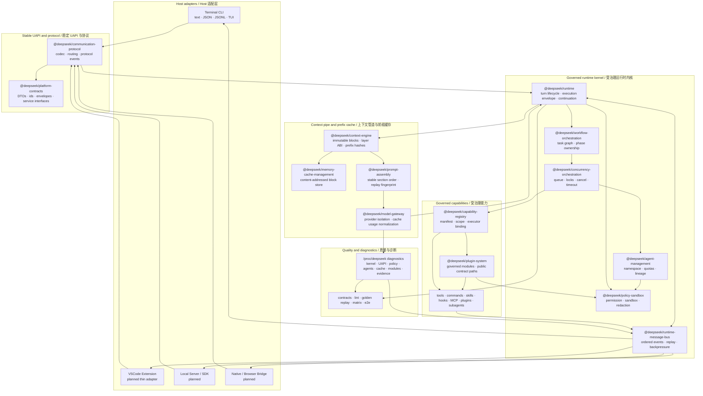
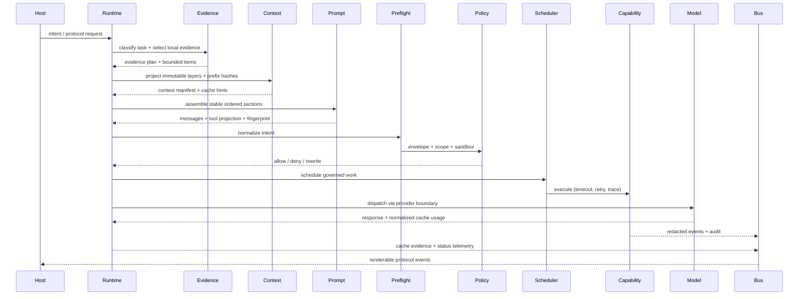
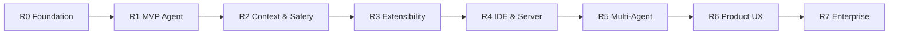

<div align="center">

# 🧠 DeepSeek CLI

**Future-Ready AI Engineering Runtime for Local Coding Agents**

**面向未来的本地 Coding Agent AI 工程运行时**

[](https://www.typescriptlang.org/)
[](https://nodejs.org/)
[](LICENSE)
[]()

</div>

---

## 🤔 What Is This? / 这是什么？

DeepSeek CLI is **not** a single CLI script. It is a **contract-first platform** — one governed runtime kernel that serves every host surface:

DeepSeek CLI **不是**一个单体脚本，而是一套**契约先行平台** — 一个受治理 runtime kernel 服务所有 host 端：



> **One kernel. One protocol. Many hosts. / 一个内核，一套协议，多端适配。**

---

## ❓ Why Build This? / 为什么做这个？

Claude Code and Codex have proven the trend: **coding agents are becoming programmable engineering systems** — reading repos, editing files, running commands, calling tools, integrating IDEs, coordinating subagents.

Claude Code 和 Codex 证明了趋势：**coding agent 正在演变为可编排的工程系统**。

**The problem / 问题：** existing products build each surface (CLI, IDE, cloud) as separate state machines with duplicated logic.

**现有产品的问题：** 每个端（CLI、IDE、Cloud）各自维护独立状态机和重复逻辑。

**Our approach / 我们的方案：** start from a clean platform architecture on day one:

| Principle / 原则 | What it means / 含义 |
| :--- | :--- |
| 🏛️ **One Kernel, Many Hosts** | CLI · VSCode · Server · SDK are thin adapters over the same runtime |
| 📨 **One Execution Envelope** | Every action (tool, skill, hook, MCP, plugin, subagent) enters one governed pipeline |
| 📡 **One Protocol Stream** | All hosts consume the same event stream — no surface-specific state machines |
| 🌍 **One Platform Abstraction** | macOS · Linux · Windows · WSL · CI · Remote degrade predictably |
| 🧪 **One Quality System** | Architecture lint → contract tests → golden replay → platform matrix → e2e |
| 🧭 **One Governance View** | `/proc/deepseek/*` diagnostics expose kernel health, rollout gates, evidence, and release blockers |
| 🔎 **Evidence-First Output** | Project facts, commands, product copy, reports, and generated artifacts must be grounded before acceptance |
| 🧭 **Visible Reasoning Surface** | TUI, text, JSON, and JSONL show bounded intent, evidence, action, verification, and outcome summaries |

Evidence-first is a product guarantee, not a prompt-writing burden. When a task is fact-sensitive, the CLI workflow is expected to gather local project evidence, classify claims as verified/inferred/assumption/unsupported, and reject unsupported strict claims such as invented package names or commands.

Evidence-first 是产品保证，不是用户写 prompt 的负担。当任务涉及项目事实时，CLI workflow 应先搜集本地项目证据，将声明分类为 verified/inferred/assumption/unsupported，并拒绝虚构 package names 或 commands 等未支持严格声明。

Visible reasoning is the user-facing explanation layer for that workflow. It records concise summaries for intent, assumptions, context selection, tool intent, edit decisions, verification, risk, and outcome, with ids and evidence links that the TUI inspector can follow. It is not raw provider reasoning or hidden chain-of-thought; records and diagnostic bundles keep only redacted summaries, evidence counts/fingerprints, and projection replay fingerprints.

可见推理是该 workflow 的用户可见解释层。它以简洁摘要记录 intent、assumptions、context selection、tool intent、edit decisions、verification、risk 与 outcome，并带有 TUI inspector 可导航的 ids 与 evidence links。它不是 raw provider reasoning 或 hidden chain-of-thought；records 与 diagnostic bundles 只保留脱敏摘要、evidence counts/fingerprints 与 projection replay fingerprints。

The chat TUI is now designed as a DeepSeek Workbench: transcript, command bar, reasoning rail, inspector, activity feed, plugin shelf, and vi-inspired focus keys share one deterministic projection. The default `auto` profile renders bounded line frames, while explicit `--tui full-screen` promotes safe raw TTY sessions to an alternate-screen renderer over the same model.

Chat TUI 现在按 DeepSeek Workbench 设计：transcript、command bar、reasoning rail、inspector、activity feed、plugin shelf 与 vi-inspired focus keys 共用同一套确定性 projection。默认 `auto` profile 渲染有界 line frames；显式 `--tui full-screen` 会在安全 raw TTY session 中提升为 alternate-screen renderer，并复用同一模型。

The cache-aware statusline is part of that workbench contract: it must surface cache hit rate, selected model, thinking mode, context size, and budget pressure from local runtime telemetry rather than host-owned state.

缓存感知 statusline 是 workbench 契约的一部分：它必须从本地 runtime telemetry 显示缓存命中率、当前模型、思考模式、上下文大小与预算压力，而不是由 host 自建状态。

---

## 🚀 Quick Start / 快速开始

```bash
npm install                # Install dependencies / 安装依赖
npm run typecheck           # Type check / 类型检查
npm run lint                # Architecture + code lint
npm test                    # Run test suite / 运行测试

npm run build:cli           # Build CLI / 构建 CLI
npm run smoke:headless      # Smoke test / 冒烟测试
```

**Try it locally / 本地体验：**

```bash
npx tsx src/apps/cli/src/index.ts run "smoke" --output jsonl
npx tsx src/apps/cli/src/index.ts chat --output jsonl
npx tsx src/apps/cli/src/index.ts context status --output json
npx tsx src/apps/cli/src/index.ts diagnostics release --output json
npx tsx src/apps/cli/src/index.ts diagnostics release --severity release-blocking --product-ready agent-namespace-quotas --output jsonl
npx tsx src/apps/cli/src/index.ts init
npx tsx src/apps/cli/src/index.ts config set model deepseek-v4-flash --output json
npx tsx src/apps/cli/src/index.ts doctor --fake-live --output json
```

<details>
<summary>🔑 Optional: Live DeepSeek API Tests（需要 API Key）</summary>

> Requires explicit env opt-in and local credentials. **Do not commit `.env`.**

```bash
DEEPSEEK_LIVE_TESTS=1 npm run smoke:live:deepseek
DEEPSEEK_LIVE_AGENT_LOOP_TESTS=1 npm run smoke:live:agent-loop
DEEPSEEK_LIVE_AUTH_TESTS=1 npm test -- tests/live/deepseek-auth-live-verification.test.ts
```

</details>

---

## 🏗️ How It Works / 工作原理

The architecture has a clear top-down flow. Read from top to bottom:

整体架构自顶向下流转，从上往下阅读即可：

### Step 1: Host collects intent / Host 收集意图

```
User → CLI / VSCode / Server / SDK → protocol request
```

Hosts are **thin adapters** — they render output and collect input, nothing more.

Host 是**轻量适配器** — 只负责渲染输出和收集输入。

### Step 2: Runtime governs execution / Runtime 治理执行

Every request enters the **same pipeline**, regardless of source:

所有请求进入**同一条管线**，不论来源：

```
Intent → Evidence → Context Pipe → Prompt Assembly → Preflight → Policy → Scheduler → Execute → Cache/Artifact Evidence → Host
         (搜证)     (上下文管道)       (可重放组装)       (归一化)    (安全门)   (调度)      (执行)    (缓存/产物证据)       (渲染)
```



### Step 3: Capabilities execute under governance / 能力在治理下执行

All capability types — tools, skills, hooks, MCP, plugins, commands, subagents — are modeled uniformly:

所有能力类型统一建模：

```
                        ┌─── core-coding-tools (read, write, edit, search, shell, git)
                        ├─── skill-system
 capability-registry ───├─── hook-system
                        ├─── mcp-gateway
                        ├─── plugin-system (governed module manifests)
                        ├─── command-system
                        └─── agent-management (subagents)
```

Each executable capability must declare: **manifest · scope · policy · sandbox · timeout · retry · audit metadata**.

每个可执行能力必须声明：**manifest · scope · policy · sandbox · timeout · retry · audit metadata**。

Plugins, extensions, MCP bridges, skills, hooks, and UI contributions are governed modules: they declare public contract paths and cannot receive private runtime objects.

plugins、extensions、MCP bridges、skills、hooks 与 UI contributions 都是受治理模块：它们声明公共契约路径，不能拿到 runtime 私有对象。

### Step 4: Evidence gates factual output / 证据门禁事实输出

For fact-sensitive repository, product, command, architecture, evaluation, or generated-artifact tasks, the runtime classifies the turn before model dispatch, selects bounded local evidence, injects it through `@deepseek/prompt-assembly`, and emits redacted evidence events. Generated factual artifacts must carry an evidence manifest; webpage output is checked by `scripts/check-webpage-generation.mjs`.

对于涉及 repository、product、command、architecture、evaluation 或 generated artifact 的事实任务，runtime 会在模型调用前分类 turn、选择有界本地证据、通过 `@deepseek/prompt-assembly` 注入，并发出脱敏 evidence events。事实型生成产物必须携带 evidence manifest；网页产物由 `scripts/check-webpage-generation.mjs` 验收。

### Step 5: Orchestration schedules work / 编排调度任务

For complex tasks, the workflow engine decomposes work into a **task graph**:

复杂任务由 workflow 引擎拆解为**任务图**：

```
Intent → Preflight → Workflow (task graph) → Policy → Scheduler → Agent/Capability → Evidence → Replay
```

| Component / 组件 | Owns / 负责 | Does NOT own / 不负责 |
| :--- | :--- | :--- |
| **Workflow** | What work exists, dependencies, phases, completion criteria | Thread pools, locks, timeouts |
| **Scheduler** | When work runs, resource locks, queue, cancel, backpressure | Model reasoning, host rendering |
| **Agent Mgmt** | Agent lifecycle, scope, budgets, parent/child lineage | Low-level scheduling |

> This separation is the key future-proofing decision: multi-agent work becomes testable, schedulable, auditable, and replayable.
>
> 这个拆分是面向未来的关键决策：多 Agent 工作可测试、可调度、可审计、可回放。

---

## 📦 Package Map / 包地图

Packages are organized by layer, top to bottom mirrors the data flow:

包按层级组织，自顶向下对应数据流：

| Layer / 层 | Packages / 包 | What it does / 职责 |
| :--- | :--- | :--- |
| 🖥️ **Hosts** | `cli` · `vscode-extension` | Render events, collect input / 渲染与输入 |
| 📜 **Contracts** | `platform-contracts` | DTOs, envelopes, errors, interfaces *(no implementation)* / 纯契约 |
| 📡 **Protocol** | `communication-protocol` · `runtime-message-bus` | Host↔kernel protocol, event bus / 协议与事件总线 |
| ⚙️ **Runtime** | `runtime` · `session-store` · `workspace-state-management` | Turn lifecycle, session, checkpoints, replay / 生命周期、会话、checkpoint 与回放 |
| 🧩 **Capability** | `capability-registry` · `core-coding-tools` · `command-system` · `skill-system` · `hook-system` · `mcp-gateway` · `plugin-system` | Governed capabilities and module contribution boundaries / 受治理能力与模块贡献边界 |
| 🎭 **Orchestration** | `workflow-orchestration` · `concurrency-orchestration` · `agent-management` · `tool-intent-preflight` | Task graph, scheduling, agents / 编排、调度、Agent |
| 🛡️ **Governance** | `policy-sandbox` · `platform-abstraction` · `config` · `credential-auth-management` · `usage-budget-management` | Policy, sandbox, platform matrix, `/proc/deepseek/*` readiness / 治理、安全与 `/proc/deepseek/*` 就绪诊断 |
| 🤖 **AI/Context** | `model-gateway` · `prompt-assembly` · `context-engine` · `index-provider` · `memory-cache-management` · `code-intelligence` | Provider isolation, replayable prompts, context, recall, memory / AI、可回放 prompt、上下文、索引与记忆 |
| 🧪 **Quality** | `testing-regression` · `tests/*` · `scripts/lint-framework` | Fakes, golden replay, matrix, lint / 质量系统 |

---

## 📡 Status / 当前状态

| Area / 领域 | Status |
| :--- | :--- |
| ⚙️ Runtime kernel & protocol | ✅ Foundation implemented; kernel boundary governance and `/proc/deepseek/*` release diagnostics active |
| 🖥️ CLI host | 🟡 Headless + DeepSeek Workbench line TUI with command bar, reasoning rail, inspector, activity feed, plugin shelf, and planned cache-aware statusline telemetry |
| 💻 VSCode host | 🟡 Skeleton exists; stays as protocol consumer |
| 🤖 DeepSeek provider | ✅ OpenAI-compatible gateway with deterministic tests |
| 🧠 Prompt assembly | ✅ Provider-neutral, deterministic, replayable section pipeline |
| 🧱 Context pipeline & prefix cache | ✅ Implemented and archived; immutable layers, prefix hashes, cache evidence, runtime bus metadata, and statusline projection verified |
| 🔎 Evidence-first workflow | 🟡 Enabled for fact-sensitive agent runs; claim extraction still expanding |
| 🧭 Visible reasoning | 🟡 Runtime records, text/JSON/JSONL output, TUI panel state, plugin contributions, and diagnostics policy implemented |
| 🌐 Webpage artifact gate | ✅ Requires `evidence.json`, source coverage, and command grounding |
| 🛠️ Core coding tools | 🔨 Read/write/edit/search/shell/git/todo under policy |
| 🔒 Safety | 🔨 Secret & sandbox hardening active |
| 🧩 Extensibility | 🟡 Built-in first-party dev plugin metadata pack active; governed module boundary diagnostics active; third-party execution/marketplace deferred |
| 🧪 Quality system | ✅ Typecheck, lint, boundary checks, deterministic test layers |

Governance diagnostics are now a first-class release surface. `deepseek diagnostics release|doctor|verify` exposes `/proc/deepseek/*` sections for kernel boundary, UAPI compatibility, context/cache health, bus pressure, policy gates, agent scopes, module status, roadmap drift, and evidence matrix. It also includes a package-level `governanceEvidenceMatrix` that separates contract, integration, golden, matrix, e2e, live-smoke, acceptance, and readiness evidence. Product-ready claims that conflict with rollout-gated, deferred, placeholder, or evidence-missing states become release blockers.

治理诊断现在是一等发布表面。`deepseek diagnostics release|doctor|verify` 会暴露 `/proc/deepseek/*` 分区，覆盖 kernel boundary、UAPI compatibility、context/cache health、bus pressure、policy gates、agent scopes、module status、roadmap drift 与 evidence matrix。它也包含包级 `governanceEvidenceMatrix`，区分 contract、integration、golden、matrix、e2e、live-smoke、acceptance 与 readiness 证据。任何与 rollout-gated、deferred、placeholder 或 evidence-missing 状态冲突的 product-ready 声明都会成为发布阻断。

First-party release plugins are bundled as trusted governed descriptors: `@deepseek/plugin-dev-checks`, `@deepseek/plugin-repo-navigator`, `@deepseek/plugin-git-review`, and `@deepseek/plugin-context-compactor`. They project into help, palette, TUI summaries, plugin contribution explanations, and extension diagnostics without plugin-private execution. The context compactor exposes `deepseek context ...` and `/context ...` for lossless context status, grep, describe, summarize, expand, budget, and pin workflows.

一方发布插件以可信 governed descriptors 形式内置：`@deepseek/plugin-dev-checks`、`@deepseek/plugin-repo-navigator`、`@deepseek/plugin-git-review` 与 `@deepseek/plugin-context-compactor`。它们会投影到 help、palette、TUI summaries、plugin contribution explanations 与 extension diagnostics，但不会执行 plugin-private code。Context compactor 通过 `deepseek context ...` 与 `/context ...` 提供无损上下文 status、grep、describe、summarize、expand、budget 与 pin workflows。

---

## 🗺️ Roadmap / 路线图



| Phase | Outcome / 结果 |
| :--- | :--- |
| **R0** | Governed runtime: contracts, gateway, scheduling, policy, tests, lint |
| **R1** | `deepseek run` & `chat` inspect, edit, test repos through governed tools |
| **R2** | Context graph, memory, sandbox matrix, budgets, checkpoints, secret hardening |
| **R3** | Skills, hooks, MCP, plugins, commands, permission diff, lockfiles |
| **R4** | CLI + VSCode + daemon + SDK share one protocol and session model |
| **R5** | Subagents, task graphs, concurrency control, replayable orchestration |
| **R6** | Raw/full-screen TUI renderers over vi-inspired modes/actions/targets, governed plugin keymaps/render hints, notifications, voice/native, browser bridge |
| **R7** | Managed policy, audit export, signed plugins, team sync |

> 📖 [Product Roadmap](docs/product/product-roadmap.md) · [Competitive Matrix](docs/product/competitive-matrix.md) · [Roadmap To Architecture](docs/product/roadmap-to-architecture.md)

---

## 📚 Deep Dive / 深入了解

<details>
<summary>📋 Execution Envelope Fields / 执行信封字段</summary>

The execution envelope is the platform contract for every action:

| Field / 字段 | Purpose / 作用 |
| :--- | :--- |
| `agent`, `session`, `turn`, `trace` | Deterministic attribution, replay, debugging / 归因、replay、调试 |
| `scope`, `resources`, `sandboxRequirements` | Prevent boundary escape / 防止逃逸 |
| `secretExposure`, `credentialRef` | Keep secrets out of model & logs / 隔离秘钥 |
| `policy`, `approval`, `auditEvidence` | Explicit, reviewable safety decisions / 显式安全决策 |
| `timeout`, `retry`, `budget`, `priority` | Scheduler control inputs / 调度控制 |
| `host`, `platform`, `capability` | Separate rendering, OS, execution / 分离渲染与执行 |

</details>

<details>
<summary>⏱️ Scheduler Dimensions / 调度维度详解</summary>

| Dimension / 维度 | Behavior / 行为 |
| :--- | :--- |
| Concurrency | Independent work parallel; conflicting scopes serial / 独立并行，冲突串行 |
| Cancellation | Host, workflow, or policy can cancel with traceable reason / 可带原因取消 |
| Timeout | Every task has bounded runtime / 每个任务有上限 |
| Retry | Only safe/idempotent work; never blindly replay / 只重试幂等任务 |
| Backpressure | Reject overload with typed errors / 过载 typed reject |
| Policy gating | Denied work never reaches scheduler / 被拒绝任务不进调度 |
| Platform degradation | Missing capabilities → deterministic deny/degrade / 缺失能力确定性降级 |

</details>

<details>
<summary>⚔️ Competitive Comparison / 竞品对比</summary>

> Public references: [Claude Code](https://code.claude.com/docs) · [Codex CLI](https://developers.openai.com/codex/cli/features) · [Codex Cloud](https://developers.openai.com/codex/cloud)

| Dimension / 维度 | Claude Code / Codex | DeepSeek CLI |
| :--- | :--- | :--- |
| Runtime | Strong product runtimes, many surfaces | Headless kernel; all hosts consume same protocol |
| Extensibility | MCP, skills, hooks, plugins, subagents | All extension types → governed capabilities with shared manifest, policy, audit |
| Tool execution | File, shell, patch, MCP, browser tools | Every path uses same envelope, preflight, sandbox, retry, redaction |
| Multi-agent | Moving toward subagents, workflows, cloud tasks | `agent-management` + `workflow-orchestration` are core packages, not patches |
| Safety | Permissions, sandboxing, credentials | Fail-closed policy; unsafe work never reaches scheduler |
| Cross-platform | macOS/Linux/WSL/Windows docs | `platform-abstraction` — no upper-layer shell assumptions |
| Testing | Product behavior must be trusted | Deterministic layered gates: lint → contract → golden → matrix → e2e |
| Provider | Anthropic-native / OpenAI-native | DeepSeek-first, OpenAI-compatible, provider repair isolated behind gateway |

</details>

<details>
<summary>🏛️ Architecture Advantages / 架构优势</summary>

| Advantage / 优势 | Impact / 效果 |
| :--- | :--- |
| 📜 Contract-first monorepo | Boundaries are lintable & testable before scale |
| 📨 Shared execution envelope | No capability can bypass policy via alternate paths |
| 🔁 Replayable event model | All surfaces reason over the same evidence |
| 🌍 Platform capability matrix | OS differences become explicit inputs |
| 🔒 Safety as schema | Secrets, scopes, sandbox are typed, not comments |
| 🧪 Tests before scale | Regressions caught by deterministic tests & lint |

</details>

---

## 🧪 Test-First Gate / 测试先行门禁

Non-documentation implementation changes are test-first. Before changing `src/**`, add or update focused unit, contract, regression, golden, matrix, integration, or e2e coverage for the behavior. Bug fixes start with a failing regression test. If a test cannot be written first, record the reason and substitute verification in OpenSpec before implementation.

非文档实现变更必须测试先行。修改 `src/**` 前，先为目标行为增加或更新聚焦的单元、契约、回归、golden、matrix、集成或 e2e 覆盖。bug 修复必须先有失败回归测试。若确实无法先写测试，必须先在 OpenSpec 记录原因与替代验证，再实现。

---

## 🔧 OpenSpec Workflow

Non-trivial architecture changes start as OpenSpec changes. Docs must be **bilingual**.

```bash
openspec list
openspec validate <change-id> --type change --strict
openspec validate --specs --strict
```

---

## 📏 Repository Rules / 仓库规则

- 🚫 Don't commit `参考/`, `.codex/`, `node_modules/`, caches, build output, `.env`
- 🧱 Keep `cli` and `vscode-extension` as separate host adapters
- 📜 `platform-contracts` must be implementation-free & host-agnostic
- 📦 Use `@deepseek/runtime` style imports, not cross-package relative paths
- 🧪 Add focused test coverage before implementation code; typecheck alone is not coverage
- 🔒 Enforce boundaries through lint & tests, not manual review alone

---

<div align="center">

**MIT License** · Copyright (c) 2026 ankye sheng

Built with ❤️ as a contract-first AI engineering platform.

[📚 Full Docs](docs/README.md) · [🗺️ Roadmap](docs/product/product-roadmap.md) · [⚔️ Competitive Matrix](docs/product/competitive-matrix.md)

</div>
