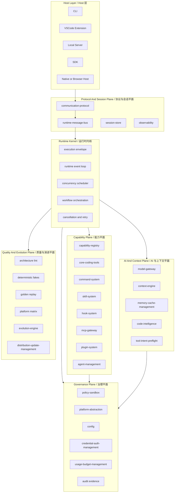
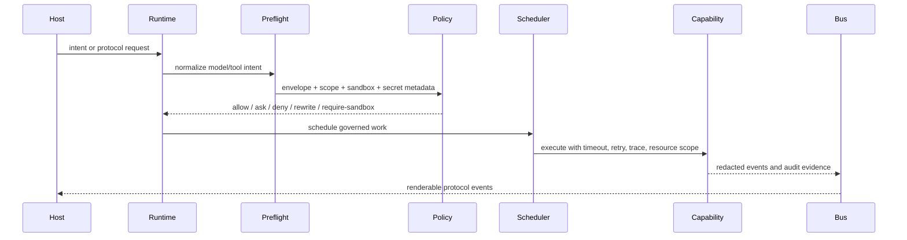
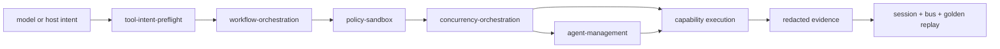

# DeepSeek CLI

DeepSeek CLI is a future-ready AI engineering runtime for local coding agents. It is being built as a contract-first platform that can power a terminal CLI, VSCode extension, local server, SDK, native host, browser bridge, and future multi-agent workflows from one governed runtime kernel.

DeepSeek CLI 是一个面向未来的 AI 工程运行时。它不是单个 CLI 脚本，而是一套 contract-first 平台：同一个受治理 runtime kernel 可以服务终端 CLI、VSCode 扩展、本地 server、SDK、native host、browser bridge 以及未来的多 Agent 工作流。

## Documentation / 文档导航

README is the landing page. The full developer documentation system lives in [docs/](docs/README.md).

README 是项目入口页。完整开发者文档体系位于 [docs/](docs/README.md)。

| Need / 需求 | Read / 阅读 |
| --- | --- |
| Understand the whole system / 理解整体系统 | [System Overview](docs/architecture/system-overview.md) |
| Understand execution flow / 理解执行流程 | [Execution Model](docs/architecture/execution-model.md) |
| Understand orchestration and scheduling / 理解编排与调度 | [Orchestration And Scheduling](docs/architecture/orchestration-and-scheduling.md) |
| Understand tools, skills, hooks, MCP, plugins, subagents / 理解工具、skills、hooks、MCP、plugins、subagents | [Capability Model](docs/architecture/capability-model.md) |
| Understand security, policy, sandbox / 理解安全、策略、沙箱 | [Security And Policy](docs/architecture/security-and-policy.md) |
| Understand package ownership / 理解包责任 | [Package Map](docs/architecture/package-map.md) |
| Start contributing / 开始贡献 | [Development Guide](docs/development/development-guide.md) |
| Run validation and acceptance / 运行校验与验收 | [Testing And Acceptance](docs/development/testing-and-acceptance.md), [Validation Gates](docs/operations/validation-gates.md) |
| Understand product direction / 理解产品方向 | [Product Roadmap](docs/product/product-roadmap.md), [Competitive Matrix](docs/product/competitive-matrix.md) |
| Look up terms and commands / 查询术语和命令 | [Glossary](docs/reference/glossary.md), [Command Index](docs/reference/command-index.md) |

## Product Thesis / 产品判断

Claude Code and Codex show the market direction clearly: coding agents are no longer just chat windows. They are becoming programmable engineering systems that read repositories, edit files, run commands, manage context, call tools, integrate with IDEs, and coordinate longer-running work.

Claude Code 和 Codex 已经证明了方向：coding agent 不再只是聊天窗口，而是在演进为可编排的工程系统。它需要读取仓库、编辑文件、执行命令、管理上下文、调用工具、接入 IDE，并协调长任务。

DeepSeek CLI takes that product direction and starts from a cleaner platform architecture:

DeepSeek CLI 沿着这个方向推进，但从更干净的平台架构开始：

- One runtime kernel, many hosts. / 一个 runtime kernel，多个 host。
- One execution envelope for every capability. / 所有能力统一进入 execution envelope。
- One protocol event stream for CLI, VSCode, server, and SDK. / CLI、VSCode、server、SDK 消费同一协议事件流。
- One platform abstraction for macOS, Linux, Windows, WSL, CI, and remote environments. / macOS、Linux、Windows、WSL、CI、remote 统一走 platform abstraction。
- One quality system: architecture lint, contract tests, integration tests, golden replay, compatibility tests, matrix tests, and e2e. / 统一质量系统：architecture lint、contract、integration、golden replay、compatibility、matrix、e2e。

## Architecture Blueprint / 总体架构图



The important boundary: hosts render and collect input; the runtime owns execution. CLI and VSCode must not become separate products with separate state machines.

关键边界：host 负责渲染和收集输入，runtime 负责执行。CLI 和 VSCode 不能演变成两套独立状态机。

## Execution Governance / 执行治理模型

Every executable action, whether it comes from a built-in tool, skill, hook, MCP server, plugin, slash command, workflow, or subagent, enters the same governed pipeline.

所有可执行动作，不管来自内置工具、skill、hook、MCP server、plugin、slash command、workflow 还是 subagent，都必须进入同一条治理管线。



The envelope is the platform contract for execution. It carries:

execution envelope 是执行的平台契约，必须携带：

| Field / 字段 | Why it exists / 作用 |
| --- | --- |
| `agent`, `session`, `turn`, `trace` | Deterministic attribution, replay, and debugging. / 可归因、可 replay、可调试。 |
| `scope`, `resources`, `sandboxRequirements` | Prevent tools from escaping declared boundaries. / 防止工具逃逸声明边界。 |
| `secretExposure`, `credentialRef` | Keep raw secrets out of model, context, logs, and output. / 避免 raw secret 进入模型、上下文、日志和输出。 |
| `policy`, `approval`, `auditEvidence` | Make safety decisions explicit and reviewable. / 安全决策显式、可审计。 |
| `timeout`, `retry`, `budget`, `priority` | Give the scheduler enough information to control work. / 让调度器能控制任务。 |
| `host`, `platform`, `capability` | Keep host rendering, OS behavior, and capability execution separated. / 分离 host 渲染、平台差异和能力执行。 |

## Orchestration And Scheduling Core / 编排与调度核心

Orchestration and scheduling are not helper modules in DeepSeek CLI. They are the center of the runtime. The model proposes intent; the platform decides how to turn that intent into bounded work.

编排与调度不是 DeepSeek CLI 的辅助模块，而是 runtime 的中心。模型提出 intent，平台决定如何把 intent 转成有边界、可治理、可回放的工作。



### Orchestration Responsibilities / 编排职责

| Responsibility / 职责 | DeepSeek owner / 归属 | Contract / 契约 | Why it matters / 价值 |
| --- | --- | --- | --- |
| Turn decomposition / 回合拆解 | `workflow-orchestration` | TaskGraph, steps, dependencies, terminal criteria | A long prompt becomes explicit units instead of hidden model reasoning. / 长 prompt 变成显式任务单元。 |
| Capability routing / 能力路由 | `capability-registry`, `tool-intent-preflight` | model-visible schema, executable manifest, repair/reject result | Provider tool calls are normalized before execution. / provider 工具调用先归一化再执行。 |
| Agent delegation / Agent 委派 | `agent-management` | agent definition, scope, model, tools, budget, lifecycle | Subagents are managed objects, not ad hoc prompts. / subagent 是受管理对象，不是临时 prompt。 |
| Work scope / 工作范围 | `platform-contracts`, `policy-sandbox` | resource scope, file scope, write scope, credential scope | Every task declares where it may read, write, execute, or call network. / 每个任务声明读写执行和网络范围。 |
| Evidence merge / 证据合并 | `runtime-message-bus`, `session-store` | runtime event, session event, replay fingerprint | Parallel or chained work merges by evidence, not by transcript text. / 并行或串行工作按证据合并。 |
| Recovery / 恢复 | `session-store`, `workspace-state-management` | resume, fork, checkpoint, rollback reference | Failed work can be resumed, forked, rejected, or rolled back. / 失败任务可恢复、分叉、拒绝或回滚。 |

### Scheduler Responsibilities / 调度职责

| Scheduling dimension / 调度维度 | First-class input / 一等输入 | Runtime behavior / 运行时行为 |
| --- | --- | --- |
| Concurrency / 并发 | task priority, resource locks, agent scope | Run independent work in parallel; serialize conflicting file/process scopes. / 独立任务并行，冲突资源串行。 |
| Cancellation / 取消 | invocation id, task id, AbortSignal propagation | Host, workflow, or policy can cancel running work with traceable reason. / host、workflow、policy 都可带原因取消。 |
| Timeout / 超时 | envelope timeout, deadline, scheduler timeout | Every task has bounded runtime and typed timeout events. / 每个任务都有上限和 typed timeout event。 |
| Retry / 重试 | retry policy, idempotency key, failure class | Retry only safe/idempotent work; never blindly replay side effects. / 只重试安全或幂等任务。 |
| Backpressure / 背压 | queue limits, active task limits | Reject overload with typed errors instead of unbounded queues. / 过载时 typed reject，不无限排队。 |
| Policy gating / 策略门禁 | policy decision, sandbox decision, approval state | Scheduler never receives denied or incomplete envelope work. / 被拒绝或 metadata 不完整的任务不进入调度器。 |
| Platform degradation / 平台降级 | platform capability matrix | Missing shell/network/storage/native support produces deterministic deny/rewrite/degrade. / 缺失平台能力产生确定性拒绝、改写或降级。 |

### Workflow And Scheduler Boundary / Workflow 与 Scheduler 边界

| Layer / 层 | Owns / 负责 | Does not own / 不负责 |
| --- | --- | --- |
| Workflow orchestration / 工作流编排 | What work exists, dependencies, phases, task graph, terminal criteria. / 有哪些工作、依赖、阶段、任务图、完成条件。 | Thread pools, queue fairness, locks, timeouts, process execution. / 不负责线程池、队列公平、锁、超时、进程执行。 |
| Concurrency scheduler / 并发调度 | When work runs, resource locks, queueing, timeout, cancellation, backpressure. / 何时运行、资源锁、排队、超时、取消、背压。 | Model reasoning, tool schema repair, policy approval, host rendering. / 不负责模型推理、工具修复、policy approval、host 渲染。 |
| Agent management / Agent 管理 | Agent definitions, lifecycle, scope, budgets, permissions, parent/child relation. / agent 定义、生命周期、范围、预算、权限、父子关系。 | Low-level scheduling fairness or direct tool execution. / 不负责底层调度公平或直接工具执行。 |

This split is the key future-proofing decision. Claude Code and Codex expose rich workflows, subagents, hooks, cloud/background tasks, and automation surfaces. DeepSeek CLI turns those product ideas into explicit platform contracts so larger multi-agent work can be tested, scheduled, audited, replayed, and governed.

这个拆分是面向未来的关键决策。Claude Code 和 Codex 都已经暴露丰富的 workflow、subagent、hook、cloud/background task 和 automation 能力。DeepSeek CLI 要把这些产品能力沉淀成显式平台契约，让更大的多 Agent 工作可以被测试、调度、审计、回放和治理。

## Architecture Plan / 架构方案

### 1. Kernel First, Host Thin / 内核优先，Host 轻薄

The runtime kernel owns turn lifecycle, policy preflight, event replay, scheduling, workflow orchestration, cancellation, and capability execution. CLI, VSCode, server, SDK, browser, and native surfaces are host adapters over the same protocol.

runtime kernel 负责 turn 生命周期、policy preflight、event replay、调度、workflow 编排、取消和能力执行。CLI、VSCode、server、SDK、browser、native 都只是同一协议之上的 host adapter。

### 2. Capability Is More Than Tool / 能力不只是工具

Claude-style skills, hooks, MCP, plugins, commands, subagents, and future workflow nodes are all modeled as capabilities. Some are only discoverable; some are executable; executable capabilities must declare manifest, scope, policy, resource, sandbox, timeout, retry, and audit metadata.

Claude 类产品里的 skills、hooks、MCP、plugins、commands、subagents 以及未来 workflow nodes 都被建模为 capability。有些只负责注册与发现，有些可以执行；可执行能力必须声明 manifest、scope、policy、resource、sandbox、timeout、retry 和 audit metadata。

### 3. Provider Behind Gateway / 模型供应商在 Gateway 后面

DeepSeek uses an OpenAI-compatible API surface through `model-gateway`, but provider-specific validation and repair stay behind the provider boundary. Tool-call path repair, platform path normalization, unsupported capability rejection, stream normalization, and live verification do not leak into the runtime kernel.

DeepSeek 通过 `model-gateway` 使用 OpenAI-compatible API，但 provider-specific 校验与修复必须留在 provider 边界后面。工具路径修复、平台路径归一化、不支持能力拒绝、stream normalization、live verification 都不能污染 runtime kernel。

### 4. Platform Is A First-Class Layer / 平台层是一等公民

Upper layers do not call shell utilities as assumptions. Search, file, process, network, sandbox, path, terminal, and credential behavior go through `platform-abstraction`, so Windows, macOS, Linux, WSL, CI, and remote environments can degrade predictably.

上层不能假设 `grep`、shell、path、filesystem 一定存在。search、file、process、network、sandbox、path、terminal、credential 都通过 `platform-abstraction`，让 Windows、macOS、Linux、WSL、CI、remote 能可预测降级。

### 5. Quality Is A Control Plane / 质量系统是控制平面

Architecture rules are enforced through AST lint and manifest lint. Runtime behavior is enforced through contract, integration, golden, compatibility, matrix, and e2e tests. Live DeepSeek API tests are opt-in and never required for default deterministic CI.

架构规则通过 AST lint 和 manifest lint 强制。运行时行为通过 contract、integration、golden、compatibility、matrix、e2e 测试强制。DeepSeek live API 测试是可选开关，不作为默认确定性 CI 的前置条件。

## Comparison With Claude Code And Codex / 与 Claude Code、Codex 的对比

Public references:

- Claude Code: [overview](https://code.claude.com/docs), [subagents](https://code.claude.com/docs/en/sub-agents), [hooks reference](https://code.claude.com/docs/en/hooks), [MCP](https://code.claude.com/docs/en/mcp), [plugins](https://code.claude.com/docs/en/plugins)
- Codex: [CLI features](https://developers.openai.com/codex/cli/features), [Codex web](https://developers.openai.com/codex/cloud), [Agents SDK orchestration](https://developers.openai.com/codex/cli/features#agents-sdk)

| Dimension / 维度 | Claude Code / Codex | DeepSeek CLI target / DeepSeek CLI 目标 |
| --- | --- | --- |
| Product category / 产品类别 | Mature agentic coding products across terminal, IDE, web/app, tools, permissions, sessions, and extensions. / 成熟 coding-agent 产品，覆盖终端、IDE、web/app、工具、权限、会话和扩展。 | Same product category, but rebuilt as a contract-first platform from day one. / 对标同类产品，但第一天就按平台契约重建。 |
| Runtime ownership / 运行时归属 | Strong product runtimes, with many user-facing surfaces. / 产品运行时成熟，产品面丰富。 | Headless kernel owns execution; every host consumes the same protocol stream. / headless kernel 统一执行，所有 host 消费同一协议流。 |
| Extensibility / 扩展性 | Claude highlights MCP, skills, hooks, memory, and custom agents; Codex documents rules, hooks, MCP, plugins, skills, and subagents. / 竞品扩展面完整。 | All extension types become governed capabilities with shared manifest, policy, scheduling, trace, and audit. / 所有扩展类型统一建模为受治理 capability。 |
| Tool execution / 工具执行 | File, shell, patch, MCP, browser/computer, and automation tools are central. / 文件、shell、patch、MCP、browser/computer 和自动化工具是核心。 | Every executable path uses the same envelope, preflight, sandbox, retry, timeout, redaction, and audit model. / 所有执行路径统一 envelope、preflight、sandbox、retry、timeout、redaction、audit。 |
| Multi-agent / 多 Agent | Both ecosystems are moving toward subagents, workflows, background tasks, and remote/long-running work. / 生态正在走向 subagent、workflow、background task 和长任务。 | `agent-management`, `workflow-orchestration`, and `concurrency-orchestration` are core platform packages, not later patches. / 多 Agent、workflow、并发调度是核心包，不是后补能力。 |
| Cross-platform / 跨平台 | Must support terminal, IDE, desktop/web, Windows/macOS/Linux/WSL differences. / 必须处理多 host 和多 OS 差异。 | Platform capability matrix is explicit; unsupported behavior is rejected or degraded with evidence. / 平台能力矩阵显式化，不支持行为拒绝或带证据降级。 |
| Safety / 安全 | Permissions, sandboxing, credentials, and enterprise policy are product-critical. / 权限、沙箱、凭证、企业策略是关键能力。 | Fail-closed policy, secret redaction, sandbox metadata, credential references, and audit evidence are platform contracts. / fail-closed、secret redaction、sandbox metadata、credential reference、audit evidence 是平台契约。 |
| Testing / 测试 | Product behavior must be trusted across surfaces. / 多端产品行为必须可信。 | Default test loop is deterministic and layered: lint, typecheck, unit, contract, integration, golden, compatibility, matrix, e2e. / 默认测试分层且确定性。 |
| Provider strategy / 模型策略 | Claude is Anthropic-native; Codex is OpenAI-native. / 各自原生绑定自家模型生态。 | DeepSeek-first provider gateway, OpenAI-compatible transport, provider-specific validation and repair isolated behind gateway. / DeepSeek-first，OpenAI-compatible，provider-specific 修复隔离在 gateway 后。 |

### Capability Comparison Matrix / 能力对比矩阵

This table compares public product surfaces, not private implementation internals. DeepSeek CLI uses the comparison to decide architecture landing zones and improvement points.

下表对比公开产品能力面，不假设竞品私有实现。DeepSeek CLI 用它确定架构落点和改进点。

| Capability / 能力 | Claude Code public surface / Claude Code 公开能力 | Codex public surface / Codex 公开能力 | DeepSeek CLI design / DeepSeek CLI 设计 | Improvement point / 改进点 |
| --- | --- | --- | --- | --- |
| Interactive coding loop / 交互式编码循环 | Terminal coding agent with tools, subagents, hooks, MCP, plugins, skills. / 终端 agent，具备工具、subagent、hook、MCP、plugin、skill。 | CLI TUI can read repos, edit, run commands, show plans/diffs, approve/reject actions. / CLI TUI 可读仓库、编辑、运行命令、展示计划与 diff、审批动作。 | CLI is only a renderer over runtime events. / CLI 只是 runtime event renderer。 | Avoid host-specific state machines; VSCode/server reuse the same kernel. / 避免 host 状态机分裂。 |
| Non-interactive automation / 非交互自动化 | Programmatic usage and hooks support automation. / 支持 programmatic usage 与 hooks 自动化。 | `codex exec` runs non-interactively and can be scripted into workflows. / `codex exec` 可脚本化。 | `deepseek -p`, `run`, `stream-json`, SDK/server all share protocol events. / headless、run、stream-json、SDK/server 共享协议事件。 | Machine output is a stable protocol, not stdout scraping. / 机器输出是稳定协议，不解析 stdout。 |
| Cloud/background work / 云端与后台任务 | Subagents can run foreground or background; agent teams coordinate separate sessions. / subagent 可前台或后台运行，agent teams 协调独立 session。 | Codex cloud can run background and parallel tasks in cloud environments. / Codex cloud 支持后台与并行云任务。 | Local first, with `remote-runtime-connectivity` as future transport over same protocol. / 本地优先，未来 remote runtime 仍走同一协议。 | Background/cloud work is a transport choice, not a second runtime. / 后台或云端是 transport 选择，不是第二套 runtime。 |
| Subagents / 子 Agent | Built-in and custom subagents, tool restrictions, models, memory, background, worktree isolation, hooks, MCP, skills. / 内置与自定义 subagent，支持工具限制、模型、记忆、后台、worktree 隔离、hooks、MCP、skills。 | Codex documents subagents, Agents SDK orchestration, and sandbox agents. / Codex 文档包含 subagents、Agents SDK orchestration、sandbox agents。 | `agent-management` defines agent lifecycle, scope, budget, tools, parent/child lineage. / `agent-management` 定义生命周期、范围、预算、工具和 lineage。 | Agent is a scheduled resource with auditable scope. / agent 是可调度资源，范围可审计。 |
| Parallel work / 并行任务 | Public docs describe parallel research with multiple subagents and chained subagents for multi-step workflows. / 文档描述多 subagent 并行研究和链式 subagent。 | Codex cloud supports parallel background tasks; CLI cloud exec supports best-of-N attempts. / cloud 支持并行后台任务，CLI cloud exec 支持 best-of-N attempts。 | `concurrency-orchestration` owns resource locks, queue limits, cancellation, timeout, backpressure. / 并发调度负责资源锁、队列、取消、超时、背压。 | Parallelism is deterministic and resource-aware, not just “spawn more agents”. / 并行具备确定性和资源感知。 |
| Workflow orchestration / 工作流编排 | Hooks, subagent chains, scheduled prompts, external events, and agent teams create workflow surfaces. / hooks、subagent chains、scheduled prompts、external events、agent teams 构成 workflow 面。 | CLI exec, cloud tasks, GitHub/Slack/Linear integrations, Agents SDK orchestration. / CLI exec、cloud tasks、GitHub/Slack/Linear、Agents SDK orchestration。 | `workflow-orchestration` owns task graph, dependencies, phases, terminal criteria. / workflow 包负责 task graph、依赖、阶段、完成条件。 | Workflow graph is inspectable, replayable, and testable. / workflow graph 可检查、可 replay、可测试。 |
| Scheduling / 调度 | Background subagents pre-approve permissions; missing permissions fail or retry in foreground. / 后台 subagent 预审批权限，权限不足时失败或前台重试。 | CLI queues follow-up input; cloud manages submitted background tasks. / CLI 可队列 follow-up，cloud 管理后台任务。 | Scheduler gates every task on policy, locks, priority, timeout, retry, idempotency, platform matrix. / 调度器基于 policy、锁、优先级、超时、重试、幂等、平台矩阵执行。 | Scheduling decisions are typed events and golden-testable. / 调度决策是 typed events，可 golden test。 |
| Hooks / hooks | Command, HTTP, MCP tool, prompt, and agent hooks across many lifecycle events. / 支持多类型 hooks 和多生命周期事件。 | Codex CLI documents hooks as configuration surface. / Codex CLI 文档包含 hooks 配置面。 | `hook-system` contributes capabilities into the same execution pipeline. / hook 作为 capability 进入同一执行管线。 | Hooks cannot bypass policy/sandbox/session/audit. / hook 不能绕过 policy、sandbox、session、audit。 |
| Plugins / 插件 | Plugins can include skills, custom agents, hooks, MCP servers, LSP servers, background monitors, settings. / plugin 可包含 skill、agent、hook、MCP、LSP、background monitor、settings。 | Codex documents plugin overview/build plugins as CLI configuration surface. / Codex 文档包含 plugin overview/build plugins。 | `plugin-system` + `extension-system` model manifests, permissions, lockfile, signatures, contribution points. / 插件系统建模 manifest、权限、lockfile、签名、贡献点。 | Plugin install is governed by permission diff and lock metadata. / 插件安装受 permission diff 和 lock 管控。 |
| Skills / Skills | Skills extend Claude capabilities and can be preloaded into subagents. / skills 可扩展能力并预加载进 subagent。 | Codex documents skills and use cases for saving workflows as skills. / Codex 文档包含 skills 与 workflow 保存。 | `skill-system` treats skills as discoverable context/capability packages. / skill 是可发现上下文/能力包。 | Skills are budgeted and projected through context policy. / skill 通过 context policy 预算与投影。 |
| MCP / MCP | Claude Code can connect to MCP and expose Claude Code itself as MCP server. / 可连接 MCP，也可作为 MCP server。 | Codex CLI can configure MCP servers and can run Codex as MCP server. / 可配置 MCP，也可作为 MCP server。 | `mcp-gateway` normalizes external tools/resources/prompts under policy. / MCP gateway 统一外部工具、资源、prompt。 | MCP tools inherit execution envelope, sandbox, credential scope, and audit. / MCP 工具继承 envelope、sandbox、credential scope、audit。 |
| Memory and context / 记忆与上下文 | Subagents can have separate context and persistent memory scopes. / subagent 独立上下文，可持久记忆。 | Codex docs expose memories, compaction, prompt caching, conversation state. / Codex 文档包含 memories、compaction、prompt caching、conversation state。 | `context-engine` + `memory-cache-management` own projection, redaction, cache, compaction. / 上下文和记忆缓存统一治理。 | Memory is not hidden global state; it enters projection as scoped evidence. / memory 不是隐藏全局状态，而是 scoped evidence。 |
| Safety and approvals / 安全与审批 | Permissions, tool restrictions, hooks, subagent permissions, managed settings. / 权限、工具限制、hooks、subagent permissions、managed settings。 | Approval and sandbox settings, agent approvals/security, cyber safety docs. / approval、sandbox、agent security。 | `policy-sandbox` fail-closes before scheduler submission. / policy-sandbox 在调度前 fail-close。 | Unsafe work never reaches scheduler. / 不安全任务不进入调度器。 |
| Cross-platform / 跨平台 | Docs include macOS/Linux/WSL and Windows shell examples. / 文档覆盖 macOS/Linux/WSL 与 Windows 示例。 | Codex docs expose Windows and sandbox configuration. / Codex 文档包含 Windows 与 sandbox 配置。 | `platform-abstraction` owns shell/search/process/fs/network/native capability matrix. / 平台层拥有能力矩阵。 | No upper-layer `grep`/shell assumptions. / 上层不假设 grep 或 shell 存在。 |
| Regression loop / 回归闭环 | Hooks can enforce formatting/logging/custom permissions; product behavior is user-facing. / hooks 可做格式化、日志、权限控制。 | Agents SDK docs include evaluate agent workflows; Codex use cases include scored improvement loops. / Agents SDK 包含 workflow eval，Codex 用例包含 scored loop。 | `testing-regression` owns fakes, golden replay, matrix, compatibility, e2e, optional live tests. / 测试回归包统一 fake、golden、matrix、compat、e2e、live。 | Product evolution is gated by replayable tests, not manual confidence. / 产品演进由可 replay 测试门禁。 |

## Architecture Advantages / 架构优势

| Advantage / 优势 | Practical impact / 实际效果 |
| --- | --- |
| Contract-first monorepo / 契约先行 monorepo | Package boundaries are visible, lintable, and testable before product scale explodes. / 代码量增长前先把边界变成可 lint、可测试契约。 |
| Shared execution envelope / 统一执行信封 | Tools, skills, hooks, MCP, plugins, and subagents cannot bypass policy by using a different path. / 各类能力不能通过不同路径绕过 policy。 |
| Replayable event model / 可 replay 事件模型 | CLI, VSCode, server, tests, diagnostics, and future cloud sync can reason over the same evidence. / 多端、测试、诊断、未来云同步共享同一证据。 |
| Platform capability matrix / 平台能力矩阵 | Windows search fallback, shell differences, sandbox support, and remote limitations become explicit inputs. / Windows 搜索替代、shell 差异、sandbox 支持、remote 限制都显式化。 |
| Safety as schema / 安全进入 schema | Secret exposure, resource scope, sandbox requirements, and audit evidence are typed, not comments. / secret、resource、sandbox、audit 是类型，不是注释。 |
| Tests before scale / 测试先于规模 | Regressions should be caught by deterministic tests and architecture lint before review or release. / 回归优先由确定性测试和架构 lint 发现。 |

## Package Map / 包地图

| Layer / 层 | Packages / 包 | Responsibility / 职责 |
| --- | --- | --- |
| Hosts / Host | `src/apps/cli`, `src/apps/vscode-extension` | Render protocol events and collect user input. / 渲染协议事件并收集用户输入。 |
| Contracts / 契约 | `src/packages/platform-contracts` | DTOs, ids, envelopes, errors, service interfaces. No implementation. / DTO、id、envelope、error、service interface，无实现。 |
| Runtime / 运行时 | `runtime`, `communication-protocol`, `runtime-message-bus`, `session-store` | Turn lifecycle, protocol, bus, session, replay. / turn 生命周期、协议、bus、session、replay。 |
| Capability / 能力 | `capability-registry`, `core-coding-tools`, `command-system`, `skill-system`, `hook-system`, `mcp-gateway`, `plugin-system` | Discoverable and executable capability surfaces. / 可发现与可执行能力面。 |
| Orchestration / 编排 | `workflow-orchestration`, `concurrency-orchestration`, `agent-management`, `tool-intent-preflight` | Task graph, scheduling, agents, model/tool repair. / task graph、调度、agent、模型工具修复。 |
| Governance / 治理 | `policy-sandbox`, `platform-abstraction`, `config`, `credential-auth-management`, `usage-budget-management` | Permissions, sandbox, platform matrix, config, credentials, budget. / 权限、沙箱、平台矩阵、配置、凭证、预算。 |
| AI/context / AI 与上下文 | `model-gateway`, `context-engine`, `memory-cache-management`, `code-intelligence` | Provider isolation, context projection, memory/cache, code evidence. / provider 隔离、上下文投影、记忆缓存、代码证据。 |
| Quality / 质量 | `testing-regression`, `tests/*`, `scripts/lint-framework` | Fakes, golden traces, matrix tests, architecture lint. / fake、golden trace、matrix test、架构 lint。 |

## Status Radar / 当前状态雷达

| Area / 领域 | Status / 状态 |
| --- | --- |
| Runtime kernel and protocol / 运行时内核与协议 | Foundation implemented; hardening continues. / 基础已实现，继续加固。 |
| CLI host / CLI host | Headless and minimal local flows exist; richer TUI is future work. / 已有 headless 与基础本地流程，rich TUI 待推进。 |
| VSCode host / VSCode host | Skeleton exists; must remain protocol consumer. / 骨架已存在，必须保持协议消费者定位。 |
| DeepSeek provider / DeepSeek provider | OpenAI-compatible gateway path exists with deterministic tests; live tests are opt-in. / OpenAI-compatible gateway 已有确定性测试，live test 可选。 |
| Core coding tools / 核心编码工具 | Read/write/edit/search/shell/git/todo foundation is being built under policy. / read/write/edit/search/shell/git/todo 正在 policy 下建设。 |
| Safety / 安全 | Secret and sandbox hardening is active. / secret 与 sandbox 加固进行中。 |
| Extensibility / 扩展性 | Landing zones exist for skills, hooks, MCP, plugins, commands, and subagents. / skills、hooks、MCP、plugins、commands、subagents 已有落点。 |
| Quality system / 质量系统 | Typecheck, architecture lint, boundary checks, deterministic test layers, and OpenSpec validation are required gates. / typecheck、架构 lint、边界检查、确定性测试层和 OpenSpec 校验是门禁。 |

## Roadmap / 路线图

| Node / 节点 | Outcome / 结果 |
| --- | --- |
| R0 Foundation / 基础 | Governed runtime platform with contracts, provider gateway, scheduling, policy, tests, and lint. / 受治理 runtime 平台。 |
| R1 MVP Coding Agent / 最小可用 Agent | `deepseek -p` and minimal interactive CLI inspect, edit, and test local repositories through governed tools. / CLI 可通过受治理工具检查、编辑、测试本地仓库。 |
| R2 Context And Safety / 上下文与安全 | Context graph, memory/cache, compaction, sandbox matrix, budgets, checkpoints, code intelligence, secret hardening. / 上下文图、记忆缓存、压缩、沙箱矩阵、预算、checkpoint、代码智能、secret 加固。 |
| R3 Extensibility / 扩展平台 | Skills, hooks, MCP, plugins, commands, permission diff, lockfiles, scoped credentials. / skills、hooks、MCP、plugins、commands、权限 diff、lockfile、scoped credentials。 |
| R4 IDE And Server / IDE 与 Server | CLI, VSCode, local daemon/server, and SDK share one protocol and session model. / CLI、VSCode、本地 daemon/server、SDK 共享协议和会话模型。 |
| R5 Multi-Agent / 多 Agent 工程 | Subagents, task graphs, concurrency control, work scopes, review/test agents, replayable orchestration. / subagent、task graph、并发控制、工作范围、review/test agent、可 replay 编排。 |
| R6 Product UX / 产品体验 | Rich TUI, keybindings/vim, notifications, banners, tips, voice/native host, browser bridge. / rich TUI、keybindings/vim、通知、banner、tips、voice/native host、browser bridge。 |
| R7 Enterprise Ecosystem / 企业与生态 | Managed policy, audit export, update channels, signed plugins, team memory/settings sync. / managed policy、audit export、update channel、signed plugin、团队记忆和设置同步。 |

Full roadmap and product docs:

完整路线图与产品文档：

- [Product Roadmap](docs/product/product-roadmap.md)
- [Competitive Matrix](docs/product/competitive-matrix.md)
- [Roadmap To Architecture](docs/product/roadmap-to-architecture.md)

## Local Development / 本地开发

```bash
npm install
npm run typecheck
npm run lint
npm test
```

Build and smoke-test the CLI:

```bash
npm run build:cli
npm run smoke:headless
```

Try local flows:

```bash
npx tsx src/apps/cli/src/index.ts -p "smoke" --output stream-json
npx tsx src/apps/cli/src/index.ts init
npx tsx src/apps/cli/src/index.ts config set model deepseek-v4-flash --output json
npx tsx src/apps/cli/src/index.ts doctor --fake-live --output json
```

Optional live DeepSeek checks require explicit environment opt-in and local credentials. Do not commit `.env`.

可选 DeepSeek live 检查需要显式环境开关和本地凭证。不要提交 `.env`。

```bash
DEEPSEEK_LIVE_TESTS=1 npm run smoke:live:deepseek
DEEPSEEK_LIVE_AUTH_TESTS=1 npm test -- tests/live/deepseek-auth-live-verification.test.ts
```

## OpenSpec Workflow / OpenSpec 工作流

Non-trivial product, architecture, protocol, safety, or test-surface changes should start as OpenSpec changes. Planning and behavior docs must be bilingual.

非平凡的产品、架构、协议、安全或测试面变更都应通过 OpenSpec 开始。规划与行为文档必须保持中英双语。

```bash
openspec list
openspec validate <change-id> --type change --strict
openspec validate --specs --strict
```

## Repository Rules / 仓库规则

- Do not commit `参考/`, `.codex/`, `node_modules/`, generated caches, build output, or local secrets.
- Keep `src/apps/cli` and `src/apps/vscode-extension` separated.
- Keep `src/packages/platform-contracts` implementation-free and host-agnostic.
- Prefer package imports such as `@deepseek/runtime` over cross-package relative imports.
- Enforce boundaries through lint and tests, not manual review alone.

- 不要提交 `参考/`、`.codex/`、`node_modules/`、生成缓存、构建产物或本地密钥。
- 保持 `src/apps/cli` 与 `src/apps/vscode-extension` 分离。
- 保持 `src/packages/platform-contracts` 无实现依赖且 host-agnostic。
- 跨包引用优先使用 `@deepseek/runtime` 这类 package import。
- 架构边界必须通过 lint 和 tests 强制，不只依赖人工 review。
