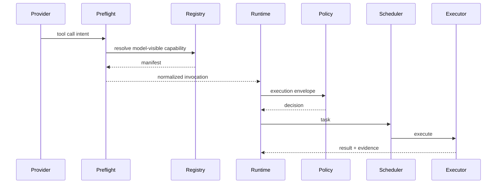

# Capability Model / 能力模型

DeepSeek CLI treats tools, commands, skills, hooks, MCP, plugins, workflows, and subagents as capability surfaces. The key distinction is whether a capability is only discoverable or also executable.

DeepSeek CLI 将工具、命令、skills、hooks、MCP、plugins、workflows 和 subagents 都视为能力面。关键区别是：某个 capability 只是可发现，还是也可执行。

## Capability Types / 能力类型

| Type / 类型 | Example / 示例 | Execution model / 执行模型 |
| --- | --- | --- |
| Core tool / 核心工具 | Read file, edit file, search, shell/test, git evidence. / 读文件、编辑、搜索、shell/test、git evidence。 | Executable capability through runtime envelope. / 通过 runtime envelope 执行。 |
| Command / 命令 | `init`, `doctor`, `config`, slash commands. / 初始化、诊断、配置、斜杠命令。 | Host action or workflow trigger; side effects still governed. / host action 或 workflow trigger；副作用仍受治理。 |
| Skill / Skill | Domain procedure, reusable workflow knowledge. / 领域流程、可复用工作流知识。 | Usually discoverable context; may contribute executable workflow templates later. / 通常是可发现上下文；未来可贡献可执行 workflow 模板。 |
| Hook / Hook | Pre-tool, post-tool, prompt, session, MCP hook. / 工具前后、prompt、session、MCP hook。 | Event-triggered capability with ordering, timeout, and failure policy. / 事件触发能力，带顺序、超时和失败策略。 |
| MCP / MCP | External tools/resources/prompts. / 外部工具、资源、prompt。 | Normalized by `mcp-gateway`, then governed as capability. / 由 `mcp-gateway` 归一化后作为 capability 治理。 |
| Plugin / 插件 | Bundle of skills, hooks, MCP servers, commands, settings. / skills、hooks、MCP servers、commands、settings 的组合包。 | Manifest + permission diff + lockfile + contribution points. / manifest、权限 diff、lockfile、贡献点。 |
| Subagent / 子 Agent | Reviewer, tester, explorer, worker. / review、test、explore、worker agent。 | Managed agent lifecycle with scoped tools, budgets, and work boundaries. / 受管理生命周期，具备范围、工具、预算、工作边界。 |
| Workflow / 工作流 | Multi-step task graph. / 多步骤任务图。 | Orchestrated graph of governed capabilities. / 由受治理 capabilities 构成的编排图。 |

## Manifest Requirements / Manifest 要求

Executable capabilities must declare:

可执行 capability 必须声明：

- Identity: id, name, version, source. / 身份：id、name、version、source。
- Trust: builtin, local, plugin, remote. / 信任：builtin、local、plugin、remote。
- Schemas: input and output JSON schemas. / schema：输入与输出 JSON schema。
- Visibility: model-visible, host-visible, executor-visible. / 可见性：model、host、executor。
- Side effects: none, read, write, network, process. / 副作用：none、read、write、network、process。
- Permissions: declared and requested. / 权限：声明与请求。
- Resource scope: paths, cwd, environment, network hosts, native capabilities. / 资源范围：路径、cwd、环境、网络 host、native capability。
- Sandbox requirements: profile, capabilities, timeout, enforcement. / 沙箱要求：profile、capabilities、timeout、enforcement。
- Redaction: secret exposure, output redaction, audit evidence. / 脱敏：secret exposure、output redaction、audit evidence。
- Replay: deterministic metadata and evidence references. / replay：确定性 metadata 与 evidence reference。
- Context projection: whether outputs are model-visible now, summarized into the session pipe, persisted as artifacts, or excluded from stable prefixes. / 上下文投影：输出是当前模型可见、摘要进入 session pipe、作为 artifact 持久化，还是从稳定前缀排除。

## Registration Vs Execution / 注册与执行

| Capability state / 能力状态 | Allowed behavior / 允许行为 | Not allowed / 禁止行为 |
| --- | --- | --- |
| Registered only / 仅注册 | Appears in catalog, docs, model schema projection, permission diff. / 出现在目录、文档、模型 schema 投影、权限 diff。 | Execute side effects. / 执行副作用。 |
| Discoverable / 可发现 | Can be selected by model or host as candidate capability. / 可被模型或 host 选择为候选能力。 | Bypass preflight or policy. / 绕过 preflight 或 policy。 |
| Executable / 可执行 | Runtime can build envelope and call executor after policy/scheduler. / runtime 可在 policy/scheduler 后调用 executor。 | Execute without envelope, trace, timeout, sandbox, audit. / 无 envelope、trace、timeout、sandbox、audit 执行。 |
| Installed extension / 已安装扩展 | Contributes manifests under lockfile and permission diff. / 在 lockfile 与权限 diff 下贡献 manifest。 | Change capabilities silently after approval. / 审批后静默改变能力。 |

## Governed Modules / 受治理模块

Plugins, extensions, MCP bridges, skills, hooks, and UI contributions enter the platform as governed modules. A governed module declares public contract paths and contribution descriptors; the owner package executes or projects the contribution after policy and lifecycle checks.

plugins、extensions、MCP bridges、skills、hooks 与 UI contributions 都以受治理模块进入平台。受治理模块声明公共契约路径与 contribution descriptor；责任包在 policy 与 lifecycle 检查后执行或投影该 contribution。

| Module contribution / 模块贡献 | Public path / 公共路径 | Owner / 责任包 |
| --- | --- | --- |
| Command or action / 命令或动作 | `module.command` | `command-system` |
| Hook / Hook | `module.hook` | `hook-system` |
| Tool / 工具 | `module.tool` | `capability-registry` / `tool-system` |
| MCP bridge / MCP 桥接 | `module.mcp-bridge` | `mcp-gateway` |
| TUI, keymap, palette, render hint / TUI、keymap、palette、render hint | `module.ui` | host projection packages |
| Diagnostics provider / 诊断提供者 | `module.diagnostics` | diagnostics surfaces |

Modules are never handed private runtime handles, host callbacks, raw credential resolvers, Node filesystem/process/network imports, or model SDK clients. Risk-bearing contributions produce a `PolicyRequest` before scheduler visibility.

模块绝不会拿到 runtime 私有句柄、host callback、raw credential resolver、Node filesystem/process/network import 或 model SDK client。带风险的 contribution 在 scheduler 可见前必须产生 `PolicyRequest`。

## Capability Flow / 能力流

## Design Rule / 设计规则

Adding a new capability type should not create a new execution path. It should add a new manifest/contribution shape and then enter the same execution pipeline.

新增 capability 类型不应创建新的执行路径。它应该新增 manifest/contribution 形态，然后进入同一执行管线。

## Tool Result Projection / 工具结果投影

Capability results must not blindly become stable prompt prefix material. Large or volatile outputs stay in the current-turn tail or artifact storage; only bounded, redacted summaries and evidence references may enter the session pipe.

Capability 结果不得无脑进入稳定 prompt 前缀。大型或易变输出留在当前回合尾部或 artifact storage；只有有界、脱敏的摘要与证据引用可以进入 session pipe。

| Result form / 结果形态 | Allowed projection / 允许投影 |
| --- | --- |
| Raw file/search/shell output / 原始文件、搜索、shell 输出 | Current turn only unless explicitly summarized. / 仅当前回合可见，除非显式摘要化。 |
| Edit/checkpoint evidence / 编辑与 checkpoint 证据 | Redacted ids, hashes, paths, and status may enter events/session. / 脱敏 id、hash、路径与状态可以进入 events/session。 |
| Plugin/MCP output / 插件或 MCP 输出 | Must pass manifest permissions, policy, redaction, and bounded projection rules. / 必须经过 manifest permission、policy、redaction 与有界投影规则。 |
| Subagent result / 子 Agent 结果 | Summary, scope, verification evidence, and open risks merge through session/bus records. / summary、scope、verification evidence 与 open risks 通过 session/bus records 合并。 |
