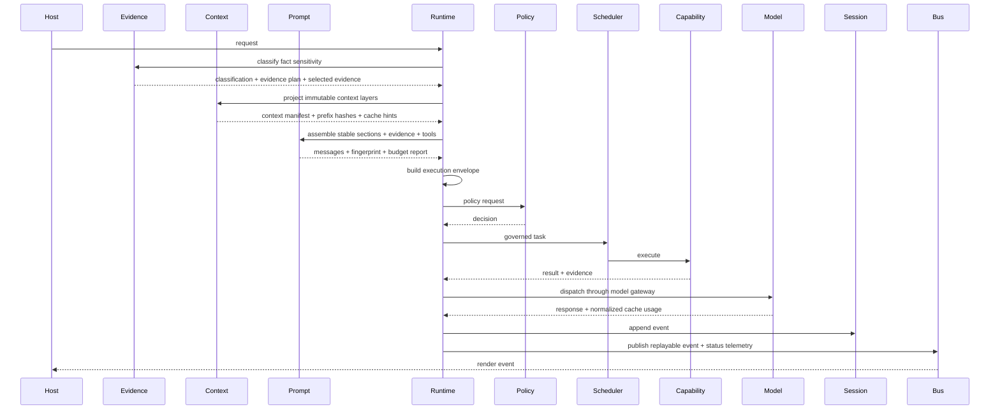

# Execution Model / 执行模型

The execution model is the contract that keeps hosts, models, tools, policies, schedulers, sessions, and traces aligned.

执行模型是让 host、模型、工具、策略、调度器、会话和 trace 保持一致的契约。

## Runtime Turn Lifecycle / Runtime 回合生命周期

## Evidence-First Turn Phase / Evidence-First 回合阶段

Fact-sensitive turns add a mandatory runtime-owned phase before model dispatch. This phase is not a user prompt convention; it is part of the execution model.

事实敏感 turn 会在模型调用前增加一个 runtime-owned 必经阶段。这个阶段不是用户 prompt 约定，而是执行模型的一部分。

1. Classify the turn as casual, speculative, or fact-sensitive. / 将 turn 分类为 casual、speculative 或 fact-sensitive。
2. For fact-sensitive tasks, create an `EvidencePlan` that names required fact classes, source groups, freshness policy, redaction policy, and stop conditions. / 对事实敏感任务创建 `EvidencePlan`，声明 required fact classes、source groups、freshness policy、redaction policy 与 stop conditions。
3. Select bounded local `EvidenceItem` records from README, package metadata, command index, product docs, OpenSpec, source files, and tests where relevant. / 从 README、package metadata、command index、product docs、OpenSpec、source files 与 tests 中选择有界 `EvidenceItem`。
4. Emit `evidence.classified`, `evidence.plan.created`, and `evidence.selected` events with redaction metadata. / 发出带脱敏 metadata 的 `evidence.classified`、`evidence.plan.created` 与 `evidence.selected` events。
5. Pass the evidence context to `prompt-assembly` while preserving the exact user prompt as the user message. / 将 evidence context 传给 `prompt-assembly`，同时保留精确用户 prompt 作为 user message。

The current implementation makes generated webpage/product artifacts evidence-checkable first. Broader deterministic claim extraction and unsupported-claim retry remain planned rollout work.

当前实现先让生成网页/产品产物可证据验收。更广泛的确定性 claim extraction 与 unsupported-claim retry 仍属于后续 rollout 工作。

## Context Pipeline Phase / 上下文管道阶段

Context projection is becoming a cache-optimized pipe instead of a monolithic prompt fragment. The runtime asks `context-engine` for a manifest of immutable layers, then passes only that manifest and bounded evidence to `prompt-assembly`.

上下文投影正在从单体 prompt 片段升级为缓存优化管道。runtime 向 `context-engine` 请求不可变分层 manifest，然后只把该 manifest 和有界证据交给 `prompt-assembly`。

The layer order is part of the execution ABI:

层顺序是执行 ABI 的一部分：

| Layer / 层 | Stability / 稳定性 | Rule / 规则 |
| --- | --- | --- |
| Kernel prefix / 内核前缀 | Highest / 最高 | Runtime contracts, stable tool summaries, and system rules change rarely. / runtime 契约、稳定工具摘要与系统规则很少变化。 |
| Project prefix / 项目前缀 | High / 高 | Repo facts, AGENTS.md, package map, and project memory are content-addressed. / 仓库事实、AGENTS.md、包地图与项目记忆按内容寻址。 |
| Session pipe / 会话管道 | Append-oriented / 追加为主 | Turn summaries and bounded tool evidence append or compact contiguous ranges. / 回合摘要和有界工具证据追加，或压缩连续区间。 |
| Current turn tail / 当前回合尾部 | Volatile / 易变 | Exact user input, active selection, and full current tool output stay at the tail. / 精确用户输入、活动选择与当前完整工具输出留在尾部。 |

Runtime does not translate cache hints into provider-specific wire fields. `model-gateway` owns that translation and reports normalized cache usage back as telemetry.

runtime 不把 cache hints 翻译成 provider-specific wire fields。该翻译由 `model-gateway` 负责，并把归一化 cache usage 作为 telemetry 回传。

## Prompt Assembly Phase / Prompt Assembly 阶段

`@deepseek/prompt-assembly` is the only package that weaves model-visible prompt sections for the runtime agent loop.

`@deepseek/prompt-assembly` 是 runtime agent loop 组装模型可见 prompt sections 的唯一 package。

- Inputs are DTOs from `@deepseek/platform-contracts`: exact prompt, history, context projection, evidence-first context, available tools, tool policy, profile, and budget. / 输入来自 `@deepseek/platform-contracts` DTO：精确 prompt、history、context projection、evidence-first context、available tools、tool policy、profile 与 budget。
- Providers contribute sections such as exact user task, evidence-first operating rules, evidence plan, selected evidence, unsupported-claim policy, projected context, PageIndex recall, tool-result continuity, skills, code intelligence, and webpage output contracts. / provider 贡献 exact user task、evidence-first operating rules、evidence plan、selected evidence、unsupported-claim policy、projected context、PageIndex recall、tool-result continuity、skills、code intelligence 与 webpage output contracts 等 sections。
- The assembler orders sections deterministically, applies budget rules, projects visible tools, and emits fingerprints/replay evidence without persisting raw unbounded prompt content. / assembler 确定性排序、执行预算规则、投影可见工具，并输出 fingerprint/replay evidence，不持久化无界 prompt 原文。
- Runtime emits `prompt.assembled` before model dispatch so hosts and golden tests can observe prompt structure without owning prompt logic. / runtime 在模型调用前发出 `prompt.assembled`，让 host 与 golden tests 可观测 prompt 结构，但不拥有 prompt 逻辑。

## Projection Cache Tiers / Projection 缓存的两级存储

These tiers describe the current projection-cache implementation. They remain compatibility behavior while the layered context pipeline and prefix-cache manifest are enabled on the main path.

以下两级描述当前 projection-cache 实现。在分层上下文管道与 prefix-cache manifest 接入主路径前，它们保持为兼容行为。

`InMemoryContextEngine` resolves `projectGraph` through two tiers so that the same request is served identically whether or not a shared cache is wired in.

`InMemoryContextEngine` 通过两级缓存解析 `projectGraph`，确保无论是否注入共享缓存，相同请求都能得到一致结果。

- Library-authoritative key: `projectionCacheKey({ requestFingerprint, dependencyFingerprints })` from `@deepseek/memory-cache-management` is the only supported key. `dependencyFingerprints` are sorted before hashing so reordered inputs collide on the same entry.
- 库权威的 key：`@deepseek/memory-cache-management` 导出的 `projectionCacheKey({ requestFingerprint, dependencyFingerprints })` 是唯一支持的 key；`dependencyFingerprints` 在 hash 前排序，保证顺序不同的输入命中同一条记录。
- Tier 1 — injected `CacheManager`: when the engine is constructed as `new InMemoryContextEngine({ cache })`, projections are stored under the `PROJECTION_CACHE_NAMESPACE` with dependency fingerprints copied into `CacheEntry.invalidation`. Repeat calls return `cache.hit === true` and the `replayFingerprint` is suffixed with `:cache-hit`.
- 第一层 —— 注入的 `CacheManager`：当引擎通过 `new InMemoryContextEngine({ cache })` 构造时，投影结果存入 `PROJECTION_CACHE_NAMESPACE`，`dependencyFingerprints` 复制到 `CacheEntry.invalidation`；重复调用返回 `cache.hit === true`，`replayFingerprint` 追加 `:cache-hit` 后缀。
- Tier 2 — private `Map` fallback: when no cache is injected, the engine falls back to a process-local `Map` keyed by the same `projectionCacheKey`. Behavior is byte-identical: `cache.hit === true` and the `:cache-hit` suffix on repeat calls.
- 第二层 —— 私有 `Map` 回退：未注入缓存时，引擎使用按同一 `projectionCacheKey` 索引的进程内 `Map`；行为逐字节一致：重复调用返回 `cache.hit === true` 并追加 `:cache-hit` 后缀。
- Invalidation: rotating any candidate's `dependencyFingerprints` changes the key, so the next call computes a fresh projection and reports `cache.hit === false`. Consumers should not mutate returned `CacheEntry` values — entries and their `invalidation` arrays are shallow-frozen before return.
- 失效：只要任意候选节点的 `dependencyFingerprints` 变化，key 就会变化，下一次调用重新计算投影并返回 `cache.hit === false`。消费者不得修改返回的 `CacheEntry` —— 条目及其 `invalidation` 数组在返回前会被浅冻结。

## Code Intelligence Auto-Enrichment / Code Intelligence 自动富化

`InMemoryContextEngine` accepts an optional `codeIntelligence` field in the same constructor options bag as `cache`. When injected, `projectGraph` enriches candidate nodes with diagnostic and symbol evidence before selection so callers do not have to pre-invoke `contextNodes` and splice the result into `candidateNodes` by hand.

`InMemoryContextEngine` 在与 `cache` 相同的 options bag 中接受可选的 `codeIntelligence` 字段。注入后，`projectGraph` 会在选择前用 diagnostic 与 symbol evidence 富化 candidate nodes，调用方无须手动先调用 `contextNodes` 再拼接结果。

- Injected path / 注入路径: the engine calls `codeIntelligence.contextNodes({ sessionId, root: scope.workspaceRoot ?? "/workspace", includeDiagnostics: true, includeSymbols: true })` inside a `try/catch`, appends `value.nodes` to the caller-supplied `candidateNodes`, and deduplicates by `id` so caller nodes take precedence over analyzer-emitted nodes.
- 注入路径：引擎在 `try/catch` 内调用 `codeIntelligence.contextNodes({ sessionId, root: scope.workspaceRoot ?? "/workspace", includeDiagnostics: true, includeSymbols: true })`，把 `value.nodes` 追加到调用方传入的 `candidateNodes` 末尾，并按 `id` 去重 —— 调用方的同 id 节点优先。
- Not-injected path / 未注入路径: when no `codeIntelligence` is provided the engine's behavior is byte-identical to prior versions; only caller-supplied `candidateNodes` participate in selection and the cache fingerprint.
- 未注入路径：未传入 `codeIntelligence` 时，引擎行为与历史版本逐字节一致；只有调用方传入的 `candidateNodes` 参与选择与缓存指纹。
- Failure fallback / 失败回退: if `contextNodes` throws, returns `ok: false`, or times out, the engine silently falls back to caller-supplied candidates and the projection status remains `completed`; enrichment failures never degrade a projection to `rejected`.
- 失败回退：当 `contextNodes` 抛错、返回 `ok: false` 或超时时，引擎静默回退到仅使用调用方传入的 candidates，投影状态保持 `completed`；富化失败永不把投影降级为 `rejected`。
- Cache interaction / 缓存交互: enriched candidates participate in `projectionCacheKey`'s `dependencyFingerprints`, so the cache naturally diverges between enriched and non-enriched calls — this is the intended behavior and does not require explicit invalidation wiring.
- 缓存交互：富化后的 candidates 参与 `projectionCacheKey` 的 `dependencyFingerprints`，因此富化与未富化调用的 cache key 自然分叉 —— 这是预期行为，不需要额外的显式失效接线。
- Edit-path invalidation / 编辑路径失效: write-path core-coding-tools (`file.write`, `file.edit`) call `deps.codeIntelligence?.invalidate(path).catch(() => undefined)` after a successful write so the next `diagnostics` or `symbols` query re-indexes the affected file.
- 编辑路径失效：写路径的 core-coding-tools（`file.write`、`file.edit`）在成功写入后非阻塞地调用 `deps.codeIntelligence?.invalidate(path).catch(() => undefined)`，使下一次 `diagnostics` 或 `symbols` 查询重新索引受影响文件。

## Plugin Lockfile / 插件 Lockfile

`PluginManager` exposes a four-state decision tree over `install` / `verify` / `snapshot` / `applyLockfile` so plugin state is reproducible across managers and tampering is fail-closed.

`PluginManager` 在 `install` / `verify` / `snapshot` / `applyLockfile` 之上暴露一棵四态决策树，使 plugin 状态在不同 manager 之间可复现，且遇到篡改 fail-closed。

- Install / 安装: `install(manifest)` first calls `verify(manifest)`; on `{ ok: false, reason: "mismatch" }` it throws `IntegrityMismatchError` with `expected` / `actual` copied from the conflicting lock entry and manifest, and the existing lock entry is left untouched. On `{ ok: true }` it computes `PermissionDiff` against the prior lock entry (if any) — `added` = permissions in the new manifest but not the prior entry, `removed` = permissions in the prior entry but not the new manifest — writes/overwrites the lock entry, and returns `{ diff, lockEntry }`.
- 安装：`install(manifest)` 先走 `verify(manifest)`；`{ ok: false, reason: "mismatch" }` 时抛 `IntegrityMismatchError`（`expected` / `actual` 复制自冲突的 lock entry 与 manifest），已有 lock entry 保持不变。`{ ok: true }` 时基于旧 lock entry（若有）计算 `PermissionDiff` —— `added` 精确为新 manifest 有、旧 entry 没有的 permission，`removed` 精确为旧 entry 有、新 manifest 没有的 permission —— 然后写入/覆盖 lock entry 并返回 `{ diff, lockEntry }`。
- Verify / 校验: `verify(manifest)` is read-only. TOFU: no lock entry for `manifest.id` → `{ ok: true }`. Entry exists and `integrity` matches → `{ ok: true }`. Entry exists and `integrity` differs → `{ ok: false, reason: "mismatch", expected, actual }`. `verify` never mutates state; `snapshot()` before and after a verify call is byte-identical.
- 校验：`verify(manifest)` 是只读操作。TOFU：`manifest.id` 无 lock entry → `{ ok: true }`；已有且 integrity 一致 → `{ ok: true }`；已有但 integrity 不一致 → `{ ok: false, reason: "mismatch", expected, actual }`。`verify` 不改动任何状态，调用前后 `snapshot()` 必须 byte-identical。
- Snapshot / 快照: `snapshot()` returns a frozen `PluginLockfile { version: 1, entries }` with `entries` sorted by `pluginId` and two-level `Object.freeze` applied to the entries array and each entry, so two managers starting from the same lockfile hash identically.
- 快照：`snapshot()` 返回 frozen `PluginLockfile { version: 1, entries }`，`entries` 按 `pluginId` 升序，数组与每个 entry 都经过 `Object.freeze` 两层冻结；相同 lockfile 在不同 manager 上哈希一致。
- Apply / 应用: `applyLockfile(lockfile)` replays entries in lockfile order. For each entry: if a matching `pluginId` + `integrity` lock entry already exists → no-op (empty `PermissionDiff`, no duplicate install event); if `pluginId` exists but `integrity` differs → throw `IntegrityMismatchError`; otherwise synthesize a `PluginManifest` from the entry and run `install` — results are returned as a `ReadonlyArray<PluginInstallResult>` in lockfile order, so re-applying the same lockfile is idempotent.
- 应用：`applyLockfile(lockfile)` 按 lockfile 顺序重放 entries。对每条 entry：已存在同 `pluginId` + `integrity` 的 lock entry → no-op（空 `PermissionDiff`，不重复触发 install 事件）；`pluginId` 已有但 `integrity` 不一致 → 抛 `IntegrityMismatchError`；否则以 entry 构造 `PluginManifest` 并走 `install`。结果以 `ReadonlyArray<PluginInstallResult>` 按 lockfile 顺序返回，重复 apply 幂等。
- Fail-closed on integrity / integrity fail-closed: the only path that overwrites an existing `pluginId` is an explicit `install(manifest)` whose `integrity` matches the current lock entry. Any mismatch — whether during `install` or during `applyLockfile` — fails the whole call rather than silently rewriting state.
- integrity fail-closed：覆盖已有 `pluginId` 的唯一路径，是 `integrity` 与当前 lock entry 一致的 `install(manifest)`；`install` 或 `applyLockfile` 中任何 integrity 不一致都会整体 fail，而不是静默改写状态。

## Execution Envelope / 执行信封

The execution envelope is the single required shape for executable work.

execution envelope 是可执行工作的唯一必需形态。

| Field group / 字段组 | Examples / 示例 | Purpose / 目的 |
| --- | --- | --- |
| Identity / 身份 | invocation id, capability id, caller, session id, task id | Attribute work and connect events. / 归因任务并连接事件。 |
| Schemas / Schema | input schema, output schema, capability version | Keep model/tool contracts stable. / 保持模型与工具契约稳定。 |
| Trust and permissions / 信任与权限 | trust, permissions, approval required | Drive policy and approval. / 驱动 policy 与 approval。 |
| Side effects / 副作用 | none, read, write, network, process | Decide sandbox and locks. / 决定 sandbox 与锁。 |
| Resource scope / 资源范围 | paths, cwd, env, network hosts, native capabilities | Bound where work may operate. / 约束工作范围。 |
| Secret exposure / Secret 暴露 | classifier decision, redaction metadata | Prevent raw secret propagation. / 防止 raw secret 扩散。 |
| Sandbox / 沙箱 | requirements, selected profile, platform capabilities | Determine whether work can run. / 判断任务是否可执行。 |
| Scheduling / 调度 | timeout, deadline, retry policy, idempotency | Control runtime behavior. / 控制运行时行为。 |
| Replay / Replay | trace, telemetry, replay policy, audit | Make execution observable and reproducible. / 让执行可观测、可复现。 |

## Event Flow / 事件流

Runtime events are the integration boundary for hosts and tests.

runtime events 是 host 和测试的集成边界。

| Event kind / 事件类型 | Meaning / 含义 |
| --- | --- |
| `context.projection.*` | Context projection started/completed/degraded/rejected. / 上下文投影开始、完成、降级、拒绝。 |
| `context.pipeline.*` | Layered context manifest, prefix hashes, drift, and compaction status. / 分层 context manifest、prefix hash、漂移与压缩状态。 |
| `model.cache.*` | Provider-neutral cache hints and normalized cache usage. / provider-neutral cache hints 与归一化 cache usage。 |
| `runtime.status.telemetry` | Local statusline inputs such as model, thinking mode, context size, cache hit rate, and budget pressure. / 本地 statusline 输入，例如模型、思考模式、上下文大小、缓存命中率与预算压力。 |
| `evidence.classified` | Task evidence sensitivity and required fact classes. / 任务证据敏感度与 required fact classes。 |
| `evidence.plan.created` | Runtime-created evidence plan before model dispatch. / 模型调用前 runtime 创建的 evidence plan。 |
| `evidence.selected` | Bounded selected evidence summary and source coverage. / 有界已选证据摘要与 source coverage。 |
| `prompt.assembled` | Prompt sections, budget, tool projection, and replay fingerprint. / prompt sections、budget、tool projection 与 replay fingerprint。 |
| `kernel.request.accepted` | Runtime accepted a request. / runtime 接受请求。 |
| `workflow.opened` / `workflow.closed` | Workflow lifecycle. / workflow 生命周期。 |
| `execution.envelope.created` | Envelope was built and persisted. / envelope 已构建并持久化。 |
| `policy.decided` | Policy action, normalized decision record, audit id, replay behavior, and redacted evidence. / policy 动作、标准化 decision record、audit id、replay behavior 与脱敏证据。 |
| `agent.scope.evaluated` | Subagent namespace, quota, and lineage handoff passed before worker launch. / worker 启动前 subagent namespace、quota 与 lineage handoff 通过。 |
| `agent.scope.denied` | Subagent work was rejected for out-of-scope path/tool or denied namespace expansion. / subagent work 因 path/tool 越界或 namespace expansion 被拒绝而停止。 |
| `agent.quota.exhausted` | Subagent quota was exhausted before work could proceed. / subagent quota 在 work 执行前耗尽。 |
| `sandbox.selected` | Selected sandbox profile. / 选中的 sandbox profile。 |
| `scheduler.*` | Queue, start, complete, fail, timeout, cancel. / 排队、启动、完成、失败、超时、取消。 |
| `capability.*` | Capability start, output, completion, failure. / capability 启动、输出、完成、失败。 |

## Host Contract / Host 契约

Hosts may:

host 可以：

- collect user input / 收集用户输入
- render runtime events / 渲染 runtime events
- request approval / 请求审批
- send cancellation / 发送取消
- project host-specific context as protocol data / 将 host-specific context 投影为协议数据
- render cache-aware status surfaces from runtime telemetry / 从 runtime telemetry 渲染缓存感知状态面

Hosts must not:

host 不得：

- call tool executors directly / 直接调用工具 executor
- own workflow state machines / 拥有 workflow 状态机
- bypass policy or sandbox / 绕过 policy 或 sandbox
- serialize raw secrets / 序列化 raw secret
- compute cache hit rate, context size, selected model, or thinking mode from runtime internals / 从 runtime internals 自行计算缓存命中率、上下文大小、模型或思考模式
