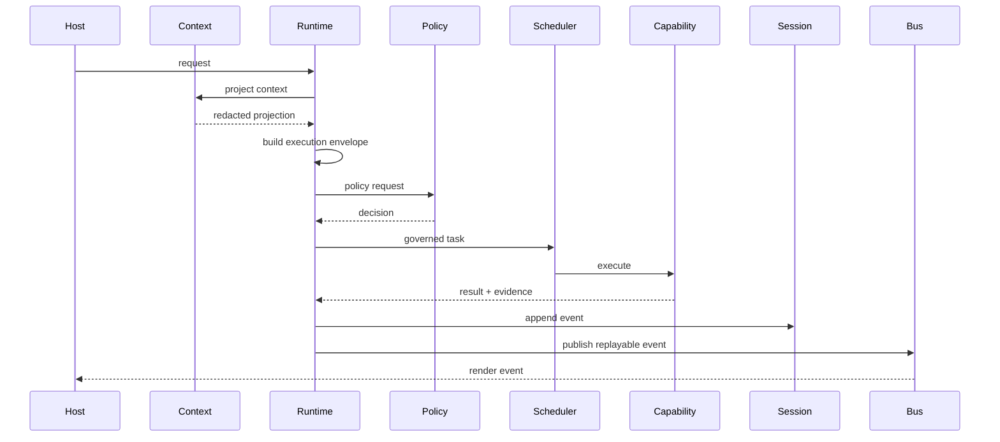

# Execution Model / 执行模型

The execution model is the contract that keeps hosts, models, tools, policies, schedulers, sessions, and traces aligned.

执行模型是让 host、模型、工具、策略、调度器、会话和 trace 保持一致的契约。

## Runtime Turn Lifecycle / Runtime 回合生命周期

## Execution Envelope / 执行信封

The execution envelope is the single required shape for executable work.

execution envelope 是可执行工作的唯一必需形态。

| Field group / 字段组 | Examples / 示例 | Purpose / 目的 |
| --- | --- | --- |
| Identity / 身份 | invocation id, capability id, caller, session id, task id | Attribute work and connect events. / 归因任务并连接事件。 |
| Schemas / Schema | input schema, output schema, capability version | Keep model/tool contracts stable. / 保持模型与工具契约稳定。 |
| Trust and permissions / 信任与权限 | trust, permissions, approval required | Drive policy and approval. / 驱动 policy 与 approval。 |
| Side effects / 副作用 | none, read, write, network, process | Decide sandbox and locks. / 决定 sandbox 与锁。 |
| Resource scope / 资源范围 | paths, cwd, env, network hosts, native capabilities | Bound where work may operate. / 约束工作范围。 |
| Secret exposure / Secret 暴露 | classifier decision, redaction metadata | Prevent raw secret propagation. / 防止 raw secret 扩散。 |
| Sandbox / 沙箱 | requirements, selected profile, platform capabilities | Determine whether work can run. / 判断任务是否可执行。 |
| Scheduling / 调度 | timeout, deadline, retry policy, idempotency | Control runtime behavior. / 控制运行时行为。 |
| Replay / Replay | trace, telemetry, replay policy, audit | Make execution observable and reproducible. / 让执行可观测、可复现。 |

## Event Flow / 事件流

Runtime events are the integration boundary for hosts and tests.

runtime events 是 host 和测试的集成边界。

| Event kind / 事件类型 | Meaning / 含义 |
| --- | --- |
| `context.projection.*` | Context projection started/completed/degraded/rejected. / 上下文投影开始、完成、降级、拒绝。 |
| `kernel.request.accepted` | Runtime accepted a request. / runtime 接受请求。 |
| `workflow.opened` / `workflow.closed` | Workflow lifecycle. / workflow 生命周期。 |
| `execution.envelope.created` | Envelope was built and persisted. / envelope 已构建并持久化。 |
| `policy.decided` | Policy action and audit evidence. / policy 动作与审计证据。 |
| `sandbox.selected` | Selected sandbox profile. / 选中的 sandbox profile。 |
| `scheduler.*` | Queue, start, complete, fail, timeout, cancel. / 排队、启动、完成、失败、超时、取消。 |
| `capability.*` | Capability start, output, completion, failure. / capability 启动、输出、完成、失败。 |

## Host Contract / Host 契约

Hosts may:

host 可以：

- collect user input / 收集用户输入
- render runtime events / 渲染 runtime events
- request approval / 请求审批
- send cancellation / 发送取消
- project host-specific context as protocol data / 将 host-specific context 投影为协议数据

Hosts must not:

host 不得：

- call tool executors directly / 直接调用工具 executor
- own workflow state machines / 拥有 workflow 状态机
- bypass policy or sandbox / 绕过 policy 或 sandbox
- serialize raw secrets / 序列化 raw secret
