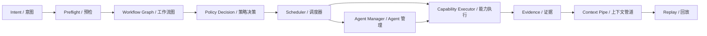

# Orchestration And Scheduling / 编排与调度

Orchestration and scheduling are the core of DeepSeek CLI. The model can suggest work, but the platform decides how that work is decomposed, governed, scheduled, cancelled, retried, and merged.

编排与调度是 DeepSeek CLI 的核心。模型可以提出工作建议，但平台决定如何拆解、治理、调度、取消、重试和合并这些工作。

## Mental Model / 心智模型

## Core Contracts / 核心契约

| Contract / 契约 | Purpose / 目的 |
| --- | --- |
| Execution envelope / 执行信封 | Carries caller, capability, session, trace, side effects, timeout, retry, secret exposure, resource scope, sandbox requirements, and audit metadata. / 携带 caller、capability、session、trace、副作用、超时、重试、secret、resource、sandbox、audit。 |
| Workflow graph / 工作流图 | Represents task decomposition, dependencies, phases, and terminal criteria. / 表示任务拆解、依赖、阶段和完成条件。 |
| Task event / 任务事件 | Represents queued, running, completed, failed, cancelled, timed-out, or backpressure states. / 表示 queued、running、completed、failed、cancelled、timed-out、backpressure 状态。 |
| Pipe event / 管道事件 | Represents ordered context/tool/plugin/agent stream state, queue pressure, compaction, or overflow decisions. / 表示有序 context/tool/plugin/agent stream 状态、队列压力、压缩或溢出决策。 |
| Agent definition / Agent 定义 | Declares agent role, scope, tools, budget, model, and lifecycle. / 声明 agent 角色、范围、工具、预算、模型和生命周期。 |
| Resource lock / 资源锁 | Prevents conflicting writes or process scopes from running concurrently. / 防止冲突写入或进程范围并发运行。 |
| Audit evidence / 审计证据 | Records policy, sandbox, platform, and redaction decisions in replayable form. / 以可 replay 形式记录 policy、sandbox、platform、redaction 决策。 |

## Mode-Aware Agent Loop / 模式感知 Agent 循环

Non-trivial CLI work uses an explicit operating loop: classify, collect evidence, plan when needed, execute through governed capabilities, verify independently, repair when safe, synthesize, and complete. Simple work can skip phases, but the skip reason is recorded as structured evidence.

非琐碎 CLI 工作使用显式运行循环：classify、collect evidence、必要时 plan、通过受治理能力 execute、独立 verify、安全时 repair、synthesize 与 complete。简单任务可以跳过阶段，但跳过原因必须以结构化证据记录。

Interaction modes and agent modes are separate axes. Interaction mode describes the host/user surface, such as `one-shot`, `chat`, `headless`, `approval`, `result-list`, `remote`, or `degraded`. Agent mode describes runtime work, such as `default`, `evidence`, `planner`, `implementer`, `verifier`, `coordinator`, `worker`, `repair`, or `synthesis`.

Interaction mode 与 agent mode 是两个独立轴。Interaction mode 描述 host/user 表面，例如 `one-shot`、`chat`、`headless`、`approval`、`result-list`、`remote` 或 `degraded`。Agent mode 描述 runtime 工作，例如 `default`、`evidence`、`planner`、`implementer`、`verifier`、`coordinator`、`worker`、`repair` 或 `synthesis`。

Reasoning effort is not an orchestration budget. Provider reasoning/thinking settings can change model behavior, but they do not prove that the system searched the project, ran verification, repaired a failure, or delegated safely. Evidence, verification, repair, delegation, and model-iteration budgets are recorded separately by runtime policy.

推理强度不是编排预算。Provider reasoning/thinking 设置可以改变模型行为，但不能证明系统已经搜索项目、运行验证、修复失败或安全委派。Evidence、verification、repair、delegation 与 model-iteration budgets 由 runtime policy 单独记录。

Coordinator and verifier defaults are gated. Coordinator mode can plan, delegate, synthesize, and reconcile, but it should not become default for broad CLI work until deterministic evaluation shows lower correction cost than the default single-agent path. Verifier mode can independently inspect artifacts and commands; non-trivial success requires command evidence or an explicit partial status.

Coordinator 与 verifier 默认启用受门禁控制。Coordinator mode 可以 plan、delegate、synthesize 与 reconcile，但在确定性评估证明其 correction cost 低于默认 single-agent 路径前，不应成为广泛 CLI 工作的默认值。Verifier mode 可以独立检查产物与命令；非琐碎成功需要 command evidence 或显式 partial 状态。

## Workflow Responsibilities / Workflow 职责

Workflow orchestration decides **what work exists**.

Workflow 编排决定“有哪些工作”。

| Responsibility / 职责 | Example / 示例 |
| --- | --- |
| Decompose user intent / 拆解用户意图 | "Fix failing tests" becomes inspect, edit, run tests, summarize evidence. / “修复测试”拆成 inspect、edit、run tests、summary。 |
| Define dependencies / 定义依赖 | Run test only after edit step finishes. / edit 完成后才能 run test。 |
| Define completion criteria / 定义完成条件 | Close workflow after capability completed, failed, or cancelled. / capability completed、failed 或 cancelled 后关闭 workflow。 |
| Define multi-agent work / 定义多 Agent 工作 | Split frontend and backend work into separate scoped agents. / 将前后端工作拆成独立范围的 agent。 |
| Preserve replayability / 保持可 replay | Persist graph ids, step ids, task ids, evidence references. / 持久化 graph id、step id、task id、evidence reference。 |

## Scheduler Responsibilities / Scheduler 职责

The scheduler decides **when work runs**.

调度器决定“工作何时运行”。

| Dimension / 维度 | Required metadata / 必需元数据 | Behavior / 行为 |
| --- | --- | --- |
| Concurrency / 并发 | Priority, locks, queue limit, agent scope | Independent tasks may run concurrently; conflicting locks serialize. / 独立任务并行，锁冲突串行。 |
| Backpressure / 背压 | Queue size, active tasks, caller | Overload becomes typed failure, not unbounded memory growth. / 过载变 typed failure，不无限增长内存。 |
| Pipe pressure / 管道压力 | Pipe id, layer, queue depth, overflow policy | Context and tool-result streams compact, defer, or fail with replayable evidence. / context 与 tool-result streams 通过可 replay 证据进行压缩、延迟或失败。 |
| Timeout / 超时 | `timeoutMs`, `deadlineAt` | Task emits typed timeout and closes workflow deterministically. / 发出 typed timeout 并确定性关闭 workflow。 |
| Cancellation / 取消 | `invocationId`, `taskId`, reason | Host or workflow can propagate cancellation through AbortSignal. / host 或 workflow 通过 AbortSignal 传播取消。 |
| Retry / 重试 | Retry policy, idempotency key, failure class | Retry only when policy says the side effect is safe. / 仅在策略认为副作用安全时重试。 |
| Policy gating / 策略门禁 | Policy decision, sandbox decision, approval | Denied work never enters scheduler. / 被拒绝工作不进入调度器。 |
| Platform degradation / 平台降级 | Platform capability matrix | Missing shell/network/storage/native capability produces deterministic deny/rewrite/degrade. / 缺失平台能力产生确定性 deny/rewrite/degrade。 |

## Boundary Between Workflow And Scheduler / Workflow 与 Scheduler 边界

| System / 系统 | Owns / 负责 | Must not do / 不应做 |
| --- | --- | --- |
| Workflow orchestration | Task graph, dependencies, phases, terminal criteria. / 任务图、依赖、阶段、结束条件。 | Direct process execution or low-level locking. / 直接进程执行或底层锁管理。 |
| Concurrency scheduler | Queueing, locks, fairness, timeout, cancellation, backpressure. / 排队、锁、公平性、超时、取消、背压。 | Model/tool reasoning or host rendering. / 模型/工具推理或 host 渲染。 |
| Agent management | Agent lifecycle, tools, budget, scope, parent-child lineage. / agent 生命周期、工具、预算、范围、父子 lineage。 | Bypass scheduler for direct execution. / 绕过 scheduler 直接执行。 |
| Runtime kernel | Envelope creation, policy preflight, scheduler handoff, event persistence. / envelope 创建、policy preflight、调度交接、事件持久化。 | Own product UI state. / 拥有产品 UI 状态。 |
| Context pipeline | Layered context manifests, prefix hashes, compaction evidence, and cache telemetry. / 分层 context manifest、prefix hash、压缩证据与 cache telemetry。 | Schedule executable side effects or render host UI. / 调度可执行副作用或渲染 host UI。 |

## Multi-Agent Direction / 多 Agent 方向

Future multi-agent work should be built on the same primitives:

未来多 Agent 工作应建立在同一套原语上：

1. Parent workflow creates bounded child tasks. / 父 workflow 创建有边界的子任务。
2. Agent manager assigns scope, tools, budgets, and lifecycle. / agent manager 分配范围、工具、预算和生命周期。
3. Scheduler enforces locks, backpressure, timeouts, and cancellation. / scheduler 强制锁、背压、超时和取消。
4. Policy/sandbox checks every executable envelope. / policy/sandbox 检查每个可执行 envelope。
5. Evidence is merged through session and bus records. / 证据通过 session 和 bus records 合并。

This makes "spawn more agents" a governed engineering operation, not a prompt trick.

这让“启动更多 agent”成为受治理的工程操作，而不是 prompt 技巧。
