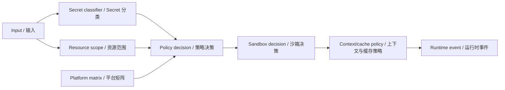

# Security And Policy / 安全与策略

DeepSeek CLI treats safety as a runtime contract, not as UI prompts around dangerous actions. Policy decisions happen before scheduler execution and before model-visible context exposure.

DeepSeek CLI 将安全视为 runtime contract，而不是危险动作周围的 UI 提示。policy 决策发生在 scheduler execution 前，也发生在 model-visible context exposure 前。

See also [Policy Sandbox Gates](policy-sandbox-gates.md) for the mandatory risky-operation taxonomy, decision record shape, replay behavior, and release readiness check.

另见 [Policy Sandbox Gates](policy-sandbox-gates.md)，其中定义强制 risky-operation taxonomy、decision record 形态、replay behavior 与 release readiness check。

## Security Pipeline / 安全管线

## Secret Boundary / Secret 边界

Raw secret values must not appear in:

raw secret 值不得出现在：

- model context / 模型上下文
- protocol events / 协议事件
- runtime events / 运行时事件
- session events / 会话事件
- cache entries / 缓存条目
- context blocks, prefix hashes when they could reveal secret-bearing content, or cache telemetry / context block、可能泄露含密内容的 prefix hash，以及 cache telemetry
- golden traces / golden traces
- snapshots / 快照
- assertion messages / 断言消息
- CLI or VSCode output / CLI 或 VSCode 输出
- evidence manifests or generated artifact checker diagnostics / evidence manifests 或生成产物 checker diagnostics

Secret-like values are classified as API keys, bearer tokens, private key blocks, environment credentials, credential references, redaction classes, or generic secrets.

疑似 secret 会被分类为 API key、bearer token、private key block、environment credential、credential reference、redaction class 或 generic secret。

## Sandbox Boundary / Sandbox 边界

Side-effecting work must declare sandbox metadata before scheduling.

带副作用的工作必须在调度前声明 sandbox metadata。

| Side effect / 副作用 | Required metadata / 必需元数据 |
| --- | --- |
| Filesystem read/write / 文件读写 | Workspace root, normalized path, traversal status, rollback availability. / workspace root、归一化路径、traversal 状态、rollback 可用性。 |
| Process or shell / 进程或 shell | Command, args, shell profile, cwd, environment scope, timeout, output redaction. / command、args、shell profile、cwd、环境范围、超时、输出脱敏。 |
| Network / 网络 | Host scope, network availability, credential scope. / host 范围、网络可用性、凭证范围。 |
| Native capability / 原生能力 | Capability name, provider status, platform availability. / capability 名称、provider 状态、平台可用性。 |
| Secure storage / 安全存储 | Scoped references, provider availability, degradation reason. / scoped reference、provider 可用性、降级原因。 |

## Policy Actions / 策略动作

| Action / 动作 | Meaning / 含义 |
| --- | --- |
| `allow` | Work may proceed. / 可继续执行。 |
| `ask` | Host must obtain approval before execution. / host 必须先获取审批。 |
| `deny` | Work is rejected before scheduler. / 调度前拒绝。 |
| `rewrite` | Work may continue only after safe rewrite/redaction. / 必须安全改写或脱敏后继续。 |
| `require-sandbox` | Work can run only under declared sandbox profile. / 必须在声明 sandbox profile 下运行。 |
| `quarantine` | Work is isolated for future review or blocked execution. / 隔离供后续审查或阻断执行。 |

## Module Policy Boundary / 模块策略边界

Governed modules route risky contributions through `policy-sandbox` before the scheduler can see them. Missing permissions, private runtime object access, undeclared owner routes, and lifecycle cleanup failures are diagnostic evidence, not warnings hidden in plugin internals.

受治理模块会在 scheduler 可见前把风险 contribution 路由到 `policy-sandbox`。缺失权限、runtime 私有对象访问、未声明 owner route 与 lifecycle cleanup 失败都属于 diagnostic evidence，而不是藏在插件内部的 warning。

| Module risk / 模块风险 | Required behavior / 必需行为 |
| --- | --- |
| Missing permission / 缺失权限 | Deny or prompt before activation. / activation 前拒绝或请求确认。 |
| Private runtime object / runtime 私有对象 | Reject before projection or execution. / projection 或 execution 前拒绝。 |
| Network, process, write, model, credential side effect / 网络、进程、写入、模型、凭证副作用 | Create `PolicyRequest` with side effect, permissions, contract path, and module identity. / 创建带有副作用、权限、契约路径与模块身份的 `PolicyRequest`。 |
| Disable or unload / 禁用或卸载 | Emit lifecycle and cleanup records. / 发出 lifecycle 与 cleanup records。 |

## Platform Capability Matrix / 平台能力矩阵

The platform abstraction exposes what the host can actually do. Policy uses this matrix to make deterministic decisions.

platform abstraction 暴露当前 host 实际能力。policy 使用该矩阵做确定性决策。

| Dimension / 维度 | Examples / 示例 |
| --- | --- |
| Filesystem / 文件系统 | read, write, read-only, traversal policy, rollback. |
| Process / 进程 | argv provider available, process execution unavailable. |
| Shell / Shell | PowerShell, bash, no-shell, degraded shell. |
| Network / 网络 | available, unavailable, scoped hosts. |
| Environment / 环境 | none, scoped, inherited. |
| Native / 原生能力 | clipboard, voice, URL handler, file watcher, image processing. |
| Secure storage / 安全存储 | available, degraded, unavailable, scoped references. |

## Failure Mode / 失败模式

The default failure mode is fail closed.

默认失败模式是 fail closed。

If the runtime cannot prove that metadata is complete, redacted, scoped, and allowed, the work does not enter the scheduler.

如果 runtime 无法证明 metadata 完整、已脱敏、有范围、且被允许，该工作不得进入 scheduler。

## Evidence Security Boundary / 证据安全边界

Evidence-first behavior must improve factual reliability without becoming a privacy leak.

Evidence-first 必须提升事实可靠性，但不能变成隐私泄漏通道。

- Evidence items use source references, bounded previews, fingerprints, fact classes, freshness metadata, and redaction metadata. / evidence item 使用 source references、有界 previews、fingerprints、fact classes、freshness metadata 与 redaction metadata。
- Secret-like files or values are excluded or redacted before becoming prompt-visible evidence. / 疑似 secret 的文件或值在成为模型可见 evidence 前必须排除或脱敏。
- The user prompt remains exact; runtime-owned evidence is added as separate prompt sections so provenance and responsibility stay visible. / 用户 prompt 保持精确；runtime-owned evidence 作为独立 prompt sections 注入，使 provenance 与责任边界清晰。
- Generated artifact manifests must not contain raw private content; they should carry source paths, claim grounding records, assumptions, unsupported claim counts, and redaction metadata. / 生成产物 manifest 不得包含 raw private content；应承载 source paths、claim grounding records、assumptions、unsupported claim counts 与 redaction metadata。
- Unsupported strict project claims, hallucinated commands, or ungrounded package names should fail closed in checkers and diagnostics. / 未支持的严格项目声明、幻觉命令或未接地 package name 应在 checker 与 diagnostics 中 fail closed。

## Cache Security Boundary / 缓存安全边界

The context pipeline improves cache reuse only after redaction and policy classification. Content-addressed storage is not a privacy boundary by itself; block content, dependency fingerprints, prefix hashes, and cache usage telemetry must be treated as potentially sensitive metadata.

上下文管道只能在脱敏与 policy 分类之后提升缓存复用。内容寻址存储本身不是隐私边界；block content、dependency fingerprint、prefix hash 与 cache usage telemetry 都必须被视为潜在敏感 metadata。

- `no-store` blocks must not be persisted or advertised as cacheable. / `no-store` block 不得持久化，也不得标记为可缓存。
- Prefix drift diagnostics should include hashes, layer ids, and reasons, not raw text. / prefix drift diagnostics 应包含 hash、layer id 与原因，而不是 raw text。
- Statusline telemetry must expose bounded counts and ratios, never raw prompts, raw tool output, or secret-like paths. / statusline telemetry 只能暴露有界计数与比例，不得暴露 raw prompt、raw tool output 或疑似 secret 路径。

## Checkpoint And Undo / Checkpoint 与 Undo

Workspace writes and exact edits create checkpoint records through `workspace-state-management`. Public evidence contains ids, hashes, status, diagnostics, and redaction metadata; raw rollback content stays private to the workspace state manager.

workspace 写入与精确编辑会通过 `workspace-state-management` 创建 checkpoint records。公开 evidence 只包含 ids、hashes、status、diagnostics 和 redaction metadata；raw rollback content 只保留在 workspace state manager 私有状态中。

Restore and undo must write through the injected platform filesystem boundary and reject stale files when the current hash no longer matches the checkpoint after-hash.

restore 与 undo 必须通过注入的平台 filesystem boundary 写入；当当前 hash 不再匹配 checkpoint after-hash 时必须拒绝恢复。
