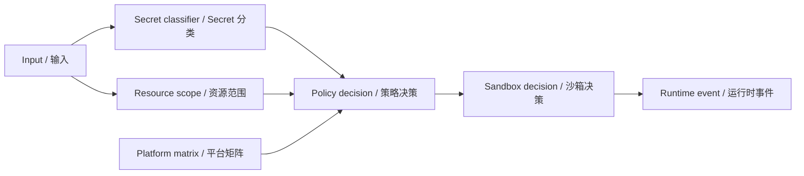

# Security And Policy / 安全与策略

DeepSeek CLI treats safety as a runtime contract, not as UI prompts around dangerous actions. Policy decisions happen before scheduler execution and before model-visible context exposure.

DeepSeek CLI 将安全视为 runtime contract，而不是危险动作周围的 UI 提示。policy 决策发生在 scheduler execution 前，也发生在 model-visible context exposure 前。

## Security Pipeline / 安全管线

## Secret Boundary / Secret 边界

Raw secret values must not appear in:

raw secret 值不得出现在：

- model context / 模型上下文
- protocol events / 协议事件
- runtime events / 运行时事件
- session events / 会话事件
- cache entries / 缓存条目
- golden traces / golden traces
- snapshots / 快照
- assertion messages / 断言消息
- CLI or VSCode output / CLI 或 VSCode 输出

Secret-like values are classified as API keys, bearer tokens, private key blocks, environment credentials, credential references, redaction classes, or generic secrets.

疑似 secret 会被分类为 API key、bearer token、private key block、environment credential、credential reference、redaction class 或 generic secret。

## Sandbox Boundary / Sandbox 边界

Side-effecting work must declare sandbox metadata before scheduling.

带副作用的工作必须在调度前声明 sandbox metadata。

| Side effect / 副作用 | Required metadata / 必需元数据 |
| --- | --- |
| Filesystem read/write / 文件读写 | Workspace root, normalized path, traversal status, rollback availability. / workspace root、归一化路径、traversal 状态、rollback 可用性。 |
| Process or shell / 进程或 shell | Command, args, shell profile, cwd, environment scope, timeout, output redaction. / command、args、shell profile、cwd、环境范围、超时、输出脱敏。 |
| Network / 网络 | Host scope, network availability, credential scope. / host 范围、网络可用性、凭证范围。 |
| Native capability / 原生能力 | Capability name, provider status, platform availability. / capability 名称、provider 状态、平台可用性。 |
| Secure storage / 安全存储 | Scoped references, provider availability, degradation reason. / scoped reference、provider 可用性、降级原因。 |

## Policy Actions / 策略动作

| Action / 动作 | Meaning / 含义 |
| --- | --- |
| `allow` | Work may proceed. / 可继续执行。 |
| `ask` | Host must obtain approval before execution. / host 必须先获取审批。 |
| `deny` | Work is rejected before scheduler. / 调度前拒绝。 |
| `rewrite` | Work may continue only after safe rewrite/redaction. / 必须安全改写或脱敏后继续。 |
| `require-sandbox` | Work can run only under declared sandbox profile. / 必须在声明 sandbox profile 下运行。 |
| `quarantine` | Work is isolated for future review or blocked execution. / 隔离供后续审查或阻断执行。 |

## Platform Capability Matrix / 平台能力矩阵

The platform abstraction exposes what the host can actually do. Policy uses this matrix to make deterministic decisions.

platform abstraction 暴露当前 host 实际能力。policy 使用该矩阵做确定性决策。

| Dimension / 维度 | Examples / 示例 |
| --- | --- |
| Filesystem / 文件系统 | read, write, read-only, traversal policy, rollback. |
| Process / 进程 | argv provider available, process execution unavailable. |
| Shell / Shell | PowerShell, bash, no-shell, degraded shell. |
| Network / 网络 | available, unavailable, scoped hosts. |
| Environment / 环境 | none, scoped, inherited. |
| Native / 原生能力 | clipboard, voice, URL handler, file watcher, image processing. |
| Secure storage / 安全存储 | available, degraded, unavailable, scoped references. |

## Failure Mode / 失败模式

The default failure mode is fail closed.

默认失败模式是 fail closed。

If the runtime cannot prove that metadata is complete, redacted, scoped, and allowed, the work does not enter the scheduler.

如果 runtime 无法证明 metadata 完整、已脱敏、有范围、且被允许，该工作不得进入 scheduler。

## Checkpoint And Undo / Checkpoint 与 Undo

Workspace writes and exact edits create checkpoint records through `workspace-state-management`. Public evidence contains ids, hashes, status, diagnostics, and redaction metadata; raw rollback content stays private to the workspace state manager.

workspace 写入与精确编辑会通过 `workspace-state-management` 创建 checkpoint records。公开 evidence 只包含 ids、hashes、status、diagnostics 和 redaction metadata；raw rollback content 只保留在 workspace state manager 私有状态中。

Restore and undo must write through the injected platform filesystem boundary and reject stale files when the current hash no longer matches the checkpoint after-hash.

restore 与 undo 必须通过注入的平台 filesystem boundary 写入；当当前 hash 不再匹配 checkpoint after-hash 时必须拒绝恢复。
