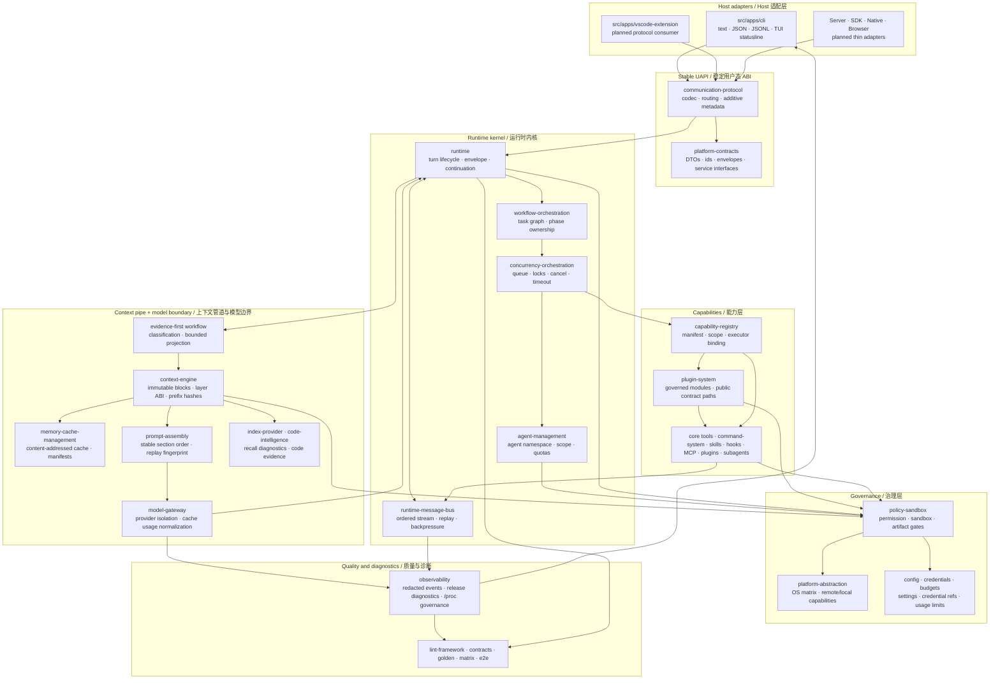

# System Overview / 系统总览

DeepSeek CLI is a contract-first AI engineering runtime. Its central design rule is that execution belongs to the runtime kernel, while every host renders and controls the same event stream.

DeepSeek CLI 是一个 contract-first 的 AI 工程运行时。核心设计规则是：执行归 runtime kernel，所有 host 只渲染和控制同一套事件流。

## System Shape / 系统形态

## Platform Layers / 平台分层

| Layer / 层 | Owner packages / 责任包 | Rule / 规则 |
| --- | --- | --- |
| Host adapters / Host 适配 | `src/apps/cli`, `src/apps/vscode-extension` | Render events and collect input only. / 只负责渲染事件与收集输入。 |
| Contracts / 契约 | `platform-contracts` | DTOs, ids, envelopes, interfaces; no implementation imports. / DTO、id、envelope、interface；不得依赖实现。 |
| Protocol and bus / 协议与总线 | `communication-protocol`, `runtime-message-bus` | Versioned messages, routing, replayable event delivery. / 版本化消息、路由、可 replay 事件分发。 |
| Runtime kernel / 运行时内核 | `runtime` | Turn lifecycle, envelope creation, policy preflight, scheduler handoff. / turn 生命周期、envelope 创建、policy preflight、调度交接。 |
| Agent execution units / Agent 执行单元 | `agent-management`, `workflow-orchestration` | Scope subagents with namespaces, quotas, lineage, output ownership, and policy-approved expansion. / 用 namespace、quota、lineage、output ownership 与 policy-approved expansion 约束 subagent。 |
| Capabilities / 能力 | `capability-registry`, `core-coding-tools`, `command-system`, future skills/hooks/MCP/plugins | Discover and execute governed capabilities. / 发现并执行受治理能力。 |
| Module boundaries / 模块边界 | `plugin-system`, `mcp-gateway`, `skill-system`, `hook-system`, host projection packages | Project plugins, extensions, MCP bridges, skills, hooks, and UI contributions into public contract paths; reject private runtime access. / 将 plugins、extensions、MCP bridges、skills、hooks 与 UI contributions 投影为公共契约路径；拒绝 runtime 私有访问。 |
| Governance / 治理 | `policy-sandbox`, `platform-abstraction`, `config`, `credential-auth-management`, `usage-budget-management` | Decide permissions, sandbox profile, platform availability, credentials, budgets. / 决定权限、沙箱、平台能力、凭证和预算。 |
| AI and context / AI 与上下文 | `model-gateway`, `prompt-assembly`, `context-engine`, `index-provider`, `memory-cache-management`, `code-intelligence` | Isolate providers, assemble replayable prompts, project context, govern recall, manage memory/cache, attach code evidence. / 隔离供应商、组装可回放 prompt、投影上下文、治理检索、管理记忆缓存、附加代码证据。 |
| Evidence and artifacts / 证据与产物 | `runtime`, `prompt-assembly`, `testing-regression`, `scripts/check-webpage-generation.mjs`, generated `evidence.json` manifests | Classify fact-sensitive turns, select bounded evidence, ground claims, and gate factual generated artifacts. / 分类事实敏感 turn、选择有界证据、为声明接地，并门禁事实型生成产物。 |
| Observability and privacy / 观测与隐私 | `observability`, `runtime-message-bus`, `testing-regression` | Normalize redacted events, keep local diagnostics, expose `/proc/deepseek/*` governance readiness, and govern diagnostic bundles and export decisions. / 归一化脱敏事件、保留本地诊断、暴露 `/proc/deepseek/*` 治理就绪状态，并治理诊断包与导出决策。 |
| Quality / 质量 | `testing-regression`, `tests/*`, `scripts/lint-framework` | Enforce contracts through deterministic tests and architecture lint. / 通过确定性测试和架构 lint 强制契约。 |

## Non-Negotiable Boundaries / 不可突破的边界

- Apps do not import other apps. / app 之间不得互相 import。
- Cross-package behavior goes through `@deepseek/platform-contracts`. / 跨包行为必须通过 `@deepseek/platform-contracts`。
- `platform-contracts` must stay implementation-free and host-agnostic. / `platform-contracts` 必须无实现依赖且 host-agnostic。
- Host adapters must not own execution state machines. / host adapter 不得拥有执行状态机。
- Host status surfaces such as the CLI statusline consume runtime telemetry; they must not reconstruct cache, model, thinking-mode, or context-size state locally. / CLI statusline 等 host 状态面只消费 runtime telemetry；不得在本地重建缓存、模型、思考模式或上下文大小状态。
- Capabilities must not bypass policy, sandbox, session, bus, or audit. / capability 不得绕过 policy、sandbox、session、bus 或 audit。
- Modules must contribute through public contracts only; no plugin, extension, MCP bridge, skill, hook, or UI contribution may receive private runtime objects. / 模块只能通过公共契约贡献；plugin、extension、MCP bridge、skill、hook 或 UI contribution 都不得拿到 runtime 私有对象。
- Raw secrets must not cross model, context, event, session, cache, trace, or host output boundaries. / raw secret 不得跨越模型、上下文、事件、会话、缓存、trace 或 host 输出边界。
- Fact-sensitive product, command, architecture, release, evaluation, and generated-artifact claims must pass through evidence-first classification and bounded evidence projection before acceptance. / 涉及产品、命令、架构、发布、评估和生成产物的事实声明，验收前必须经过 evidence-first 分类与有界证据投影。
- Product-ready claims must pass `/proc/deepseek/*` governance diagnostics: placeholder, deferred, rollout-gated, or evidence-missing states are release-blocking. / product-ready 声明必须通过 `/proc/deepseek/*` 治理诊断：placeholder、deferred、rollout-gated 或 evidence-missing 状态都会阻断发布。

## Why This Shape / 为什么这样设计

AI coding tools grow quickly: tools, plugins, skills, hooks, MCP, subagents, memory, IDE integration, server mode, and cloud tasks all compete to become local shortcuts. Without a kernel-owned execution model, each surface starts building its own state machine.

AI coding 工具会快速膨胀：工具、插件、skills、hooks、MCP、subagents、memory、IDE 集成、server mode、cloud tasks 都容易变成局部快捷路径。如果没有 kernel-owned execution model，每个产品面都会开始构建自己的状态机。

DeepSeek CLI avoids that by making execution an explicit platform protocol:

DeepSeek CLI 通过显式平台协议避免这一点：

- Intent enters through a host or model gateway. / intent 从 host 或 model gateway 进入。
- Runtime classifies whether the turn needs evidence and builds an evidence plan. / runtime 分类 turn 是否需要证据，并构建 evidence plan。
- Prompt assembly weaves exact user input, selected evidence, tool projection, and output contracts into replayable messages. / prompt assembly 将精确用户输入、已选证据、工具投影与输出契约组装成可回放消息。
- Runtime builds an execution envelope. / runtime 构建 execution envelope。
- Policy and sandbox decide before scheduling. / policy 和 sandbox 在调度前决策。
- Scheduler runs only governed work. / scheduler 只运行受治理工作。
- Events are redacted, persisted, replayable, and host-renderable. / events 脱敏、持久化、可 replay、可由 host 渲染。
- Generated factual artifacts carry evidence manifests that can be checked outside the model. / 事实型生成产物携带可在模型外检查的 evidence manifest。
- Diagnostic evidence is local-first, privacy-governed, and export-denied by default. / diagnostic evidence 默认 local-first、受 privacy 治理，并拒绝外部导出。
