## Platform Architecture

DeepSeek CLI should be built as a layered agent platform. CLI and VSCode are host adapters. The product core is a headless runtime kernel connected to platform services through stable contracts. Every major cross-cutting concern has a single owner: protocol, runtime message bus, workflow, concurrency, memory, cache, capability, command, skill, hook, MCP, plugin, policy, platform execution, observability, and regression.

DeepSeek CLI 应构建为分层 agent platform。CLI 和 VSCode 是 host adapters。产品核心是 headless runtime kernel，通过稳定 contracts 连接平台服务。每个跨切面能力都有唯一所有者：protocol、runtime message bus、workflow、concurrency、memory、cache、capability、command、skill、hook、MCP、plugin、policy、platform execution、observability 和 regression。

```mermaid
flowchart TB
  cli[apps/cli<br/>thin CLI host] --> protocol
  vscode[apps/vscode-extension<br/>VSCode host] --> protocol
  tests[tests / replay / CI] --> protocol
  server[future server transport] -. future .-> protocol

  subgraph contractsLayer[Contract Layer / 契约层]
    contracts[platform-contracts<br/>interfaces, DTOs, ids, envelopes]
  end

  subgraph protocolLayer[Protocol Layer / 通信层]
    protocol[communication-protocol<br/>messages, routing, transport, backpressure]
  end

  subgraph busLayer[Runtime Message Bus / 运行时消息总线]
    bus[runtime-message-bus<br/>topics, commands, events, replay]
  end

  subgraph runtimeLayer[Runtime Kernel / 运行时内核]
    runtime[runtime<br/>turn loop, event stream, tool-call loop]
    workflow[workflow-orchestration<br/>task graph, checkpoints, rollback]
    concurrency[concurrency-orchestration<br/>scopes, cancel, locks, rate limits]
    agents[agent-management<br/>definitions, instances, scopes]
  end

  subgraph intelligenceLayer[Intelligence Layer / 智能层]
    model[model-gateway<br/>DeepSeek + mock + future providers]
    context[context-engine<br/>context graph + projection]
    memory[memory-cache-management<br/>memory + caches + invalidation]
  end

  subgraph capabilityLayer[Capability Layer / 能力层]
    caps[capability-registry<br/>typed capabilities]
    commands[command-system<br/>typed commands + invocation]
    skills[skill-system<br/>governed skill packages]
    hooks[hook-system<br/>lifecycle hooks + isolation]
    mcp[mcp-gateway<br/>external MCP adapters]
    plugins[plugin-system<br/>packages, lockfile, install]
    ext[extension-system<br/>manifest + trust + contributions]
    evo[evolution-engine<br/>feature gates + migrations + rollback]
  end

  subgraph safetyLayer[Safety Layer / 安全治理层]
    policy[policy-sandbox<br/>policy + approval + sandbox + audit]
  end

  subgraph platformLayer[Platform Services / 平台服务层]
    platform[platform-abstraction<br/>macOS, Windows, Linux, fake]
    sessions[session-store<br/>events, snapshots, resume, fork]
    config[config<br/>profiles, settings, secrets refs]
    credentials[credential-auth-management<br/>auth + secret references]
    usage[usage-budget-management<br/>tokens, cost, time, limits]
    workspace[workspace-state-management<br/>roots, snapshots, edit txns]
    codeintel[code-intelligence<br/>diagnostics, symbols, LSP]
    remote[remote-runtime-connectivity<br/>future remote transports]
    distribution[distribution-update-management<br/>releases, catalogs, rollback]
    future[future-capability-landings<br/>UX + product landing map]
    obs[observability<br/>logs, metrics, traces, audit sink]
    regression[testing-regression<br/>golden traces, replay, scenarios]
  end

  contracts -. defines .-> protocol
  contracts -. defines .-> bus
  contracts -. defines .-> runtime
  contracts -. defines .-> workflow
  contracts -. defines .-> concurrency
  contracts -. defines .-> agents
  contracts -. defines .-> model
  contracts -. defines .-> context
  contracts -. defines .-> memory
  contracts -. defines .-> caps
  contracts -. defines .-> commands
  contracts -. defines .-> skills
  contracts -. defines .-> hooks
  contracts -. defines .-> mcp
  contracts -. defines .-> plugins
  contracts -. defines .-> ext
  contracts -. defines .-> evo
  contracts -. defines .-> credentials
  contracts -. defines .-> usage
  contracts -. defines .-> workspace
  contracts -. defines .-> codeintel
  contracts -. defines .-> policy
  contracts -. defines .-> platform
  contracts -. defines .-> sessions
  contracts -. defines .-> obs

  protocol --> runtime
  runtime --> bus
  bus --> workflow
  bus --> concurrency
  bus --> agents
  bus --> caps
  bus --> skills
  bus --> hooks
  bus --> policy
  bus --> sessions
  bus --> obs
  runtime --> workflow
  runtime --> concurrency
  runtime --> agents
  runtime --> model
  runtime --> context
  runtime --> memory
  runtime --> caps
  runtime --> commands
  runtime --> skills
  runtime --> hooks
  runtime --> policy
  runtime --> sessions
  runtime --> usage
  runtime --> obs

  workflow --> concurrency
  workflow --> agents
  workflow --> sessions
  workflow --> policy

  agents --> caps
  agents --> context
  agents --> memory
  agents --> model
  agents --> policy

  context --> memory
  context --> skills
  context --> workspace
  context --> codeintel
  model --> concurrency
  model --> usage
  caps --> concurrency
  caps --> platform
  caps --> policy
  commands --> workflow
  commands --> caps
  commands --> policy
  skills --> context
  skills --> caps
  skills --> memory
  skills --> usage
  hooks --> bus
  hooks --> policy
  mcp --> caps
  mcp --> commands
  mcp --> context
  mcp --> credentials
  plugins --> ext
  plugins --> skills
  plugins --> hooks
  plugins --> mcp
  plugins --> commands
  plugins --> config
  plugins --> policy
  ext --> caps
  ext --> agents
  ext --> context
  ext --> policy
  ext --> plugins
  evo --> ext
  evo --> plugins
  evo --> skills
  evo --> agents
  evo --> config
  evo --> sessions
  evo --> distribution
  credentials --> policy
  workspace --> platform
  workspace --> policy
  workspace --> sessions
  workspace --> codeintel
  policy --> platform
  policy --> obs
  distribution --> evo
  future --> protocol
  future --> commands
  future --> plugins
  future --> policy
  future --> remote
  future --> distribution
  remote --> protocol
  remote --> sessions
  regression --> protocol
  regression --> bus
  regression --> sessions
```



Key principles:

- Host adapters are thin. CLI and VSCode translate host input/output and never own agent reasoning or platform state. / host adapters 必须薄。CLI 和 VSCode 只转换 host input/output，不拥有 agent reasoning 或平台状态。
- `platform-contracts` is the only stable cross-package API surface. / `platform-contracts` 是唯一稳定跨包 API 面。
- Runtime is headless and event-driven. / runtime 是 headless 且 event-driven。
- Communication is protocol-first, not stdout parsing. / 通信以 protocol 为先，不依赖解析 stdout。
- Runtime internal coordination uses the message bus, not host protocol side effects. / runtime 内部协调用 message bus，不用 host protocol side effects。
- Workflow and concurrency are platform services, not hidden promise chains. / workflow 与 concurrency 是平台服务，不是隐藏 promise chains。
- Memory and cache are governed stores with provenance, invalidation, and redaction. / memory 与 cache 是有 provenance、invalidation 和 redaction 的治理型存储。
- Plugins are distributable packages; capabilities, skills, hooks, agents, and connectors remain governed by their owning subsystems. / plugins 是可分发 packages；capabilities、skills、hooks、agents 和 connectors 仍由各自 owning subsystems 治理。
- Test and self-regression are architecture services, not late QA activities. / 测试与自回归是架构服务，不是后置 QA。

## Platform Contracts

`src/packages/platform-contracts` defines all cross-package contracts. It must stay implementation-free and host-agnostic.

`src/packages/platform-contracts` 定义所有跨包 contracts。它必须保持 implementation-free 和 host-agnostic。

Recommended modules:

```text
ids.ts
errors.ts
events.ts
protocol.ts
bus.ts
runtime.ts
host.ts
workflow.ts
concurrency.ts
agent.ts
model.ts
capability.ts
command.ts
skill.ts
hook.ts
mcp.ts
plugin.ts
extension.ts
context.ts
memory.ts
cache.ts
credential.ts
usage.ts
policy.ts
sandbox.ts
session.ts
platform.ts
evolution.ts
code-intelligence.ts
remote.ts
distribution.ts
config.ts
observability.ts
testing.ts
index.ts
```

Core service interfaces:

```ts
export interface RuntimeDependencies {
  protocol: ProtocolRouter;
  bus: RuntimeMessageBus;
  workflow: WorkflowOrchestrator;
  concurrency: ConcurrencyOrchestrator;
  agents: AgentManager;
  models: ModelGateway;
  capabilities: CapabilityRegistry;
  commands: CommandSystem;
  skills: SkillSystem;
  hooks: HookSystem;
  mcp: McpGateway;
  plugins: PluginManager;
  extensions: ExtensionManager;
  context: ContextEngine;
  memory: MemoryManager;
  cache: CacheManager;
  credentials: CredentialManager;
  usage: UsageBudgetManager;
  policy: PolicyEngine;
  approvals: ApprovalBroker;
  sandbox: SandboxRuntime;
  sessions: SessionStore;
  platform: PlatformRuntime;
  evolution: EvolutionEngine;
  codeIntelligence: CodeIntelligenceService;
  remote: RemoteRuntimeConnectivity;
  distribution: DistributionUpdateManager;
  config: ConfigStore;
  observability: ObservabilitySink;
  regression: RegressionHarness;
}
```

Contracts use branded ids, versioned envelopes, serializable DTOs, redacted error shapes, and trace context. Implementation classes stay in implementation packages.

contracts 使用 branded ids、versioned envelopes、serializable DTOs、redacted error shapes 和 trace context。实现类保留在实现包中。

## Communication Protocol

The platform uses a versioned message protocol across hosts and runtime. In-process adapters, CLI stream-json, VSCode extension host, tests, and future server mode should all use the same message envelope.

平台在 hosts 与 runtime 之间使用版本化 message protocol。in-process adapters、CLI stream-json、VSCode extension host、tests 和未来 server mode 都应使用同一 message envelope。

Protocol pipeline:

```text
Host Input
  -> decode/validate envelope
  -> authenticate/trust host context
  -> route to runtime/workflow/session
  -> apply policy/concurrency gates
  -> execute runtime turn or control command
  -> encode RuntimeEvent / ProtocolResponse
  -> host renderer or transport stream
```

协议管线：

```text
Host Input
  -> 解码/校验 envelope
  -> 认证/信任 host context
  -> 路由到 runtime/workflow/session
  -> 应用 policy/concurrency gates
  -> 执行 runtime turn 或 control command
  -> 编码 RuntimeEvent / ProtocolResponse
  -> host renderer 或 transport stream
```

Messages must include protocol version, schema version, message id, correlation id, session id when available, trace context, source host, and redaction classification.

消息必须包含 protocol version、schema version、message id、correlation id、可选 session id、trace context、source host 和 redaction classification。

## Runtime Message Bus

The host-runtime protocol is the external boundary. The runtime message bus is the internal coordination boundary between runtime services. They share envelope discipline, but they have different ownership and security responsibilities.

host-runtime protocol 是外部边界。runtime message bus 是 runtime services 之间的内部协作边界。二者共享 envelope discipline，但 ownership 与 security responsibilities 不同。

Message bus pipeline:

```text
Service Command/Event
  -> validate topic ownership and schema
  -> attach correlation, causation, trace, redaction metadata
  -> apply policy for trust/sandbox/extension/skill boundary crossings
  -> deliver through bounded queues with ordering/backpressure
  -> persist selected replayable records
  -> emit observability and audit metadata
```

消息总线管线：

```text
Service Command/Event
  -> 校验 topic ownership 和 schema
  -> 附加 correlation、causation、trace、redaction metadata
  -> 对 trust/sandbox/extension/skill boundary crossing 应用 policy
  -> 通过 bounded queues 按 ordering/backpressure 投递
  -> 持久化选定的 replayable records
  -> 输出 observability 和 audit metadata
```

The first implementation can be deterministic in-memory pub/sub, but the contracts must support replay, durable traces, and future process or server-separated services.

第一版可以实现 deterministic in-memory pub/sub，但 contracts 必须支持 replay、durable traces，以及未来跨进程或 server-separated services。

## Runtime, Workflow, and Concurrency

Runtime owns the turn loop and event stream. Workflow owns user task decomposition and pipeline state. Concurrency owns execution mechanics.

runtime 负责 turn loop 和 event stream。workflow 负责用户任务拆解和 pipeline state。concurrency 负责执行机制。

Separation:

- Runtime: start session, run turn, call model, dispatch capabilities, emit events. / runtime：启动 session、执行 turn、调用模型、分发 capabilities、输出 events。
- Workflow: represent tasks as step graphs, checkpoints, handoff, rollback, retry policy, and completion criteria. / workflow：用 step graph 表示任务、checkpoint、handoff、rollback、retry policy 和完成标准。
- Concurrency: schedule tasks, propagate cancellation, enforce deadlines, locks, queues, rate limits, retry budgets, and backpressure. / concurrency：调度任务、传播取消、执行 deadlines、locks、queues、rate limits、retry budgets 和 backpressure。

The first pass may implement a single-turn, single-agent workflow, but it must still use workflow and concurrency contracts so multi-step and multi-agent execution can be added without rewriting runtime.

第一阶段可以只实现 single-turn、single-agent workflow，但必须使用 workflow 和 concurrency contracts，避免未来加入多步骤和多 agent 时重写 runtime。

## Agent Management

Agent definitions can come from built-ins, user config, workspace config, or extensions. Agent lifecycle, scopes, profiles, session binding, and audit are centrally owned by `agent-management`.

agent definitions 可以来自 built-ins、user config、workspace config 或 extensions。agent lifecycle、scopes、profiles、session binding 和 audit 由 `agent-management` 集中管理。

An `AgentDefinition` declares role, model profile, prompt profile, capability scope, context scope, memory scope, policy scope, lifecycle hooks, and delegation metadata. An `AgentInstance` is a runtime-bound execution identity with status, active session, current turn/task, cancellation state, and audit metadata.

`AgentDefinition` 声明 role、model profile、prompt profile、capability scope、context scope、memory scope、policy scope、lifecycle hooks 和 delegation metadata。`AgentInstance` 是 runtime 绑定的执行身份，包含 status、active session、current turn/task、cancellation state 和 audit metadata。

## Intelligence State: Context, Memory, and Cache

Context is the projection surface for a turn. Memory is durable or semi-durable knowledge. Cache is derived, invalidatable acceleration.

context 是单次 turn 的投影面。memory 是持久或半持久知识。cache 是可失效的派生加速层。

Layers:

- Context graph: user, assistant, tool result, rule, summary, file, diagnostic, memory reference nodes. / context graph：user、assistant、tool result、rule、summary、file、diagnostic、memory reference nodes。
- Working memory: session-scoped active facts and plans. / working memory：session-scoped 活跃事实和计划。
- Project memory: repository/workspace conventions and learned project facts. / project memory：repository/workspace 约定与项目事实。
- User memory: user preferences and durable profile facts. / user memory：用户偏好和持久资料事实。
- Semantic memory: embedding/retrieval-ready records with provenance. / semantic memory：带 provenance 的 embedding/retrieval-ready records。
- Cache: model response fragments, token counts, file snapshots, search indexes, tool results, extension manifests, platform command availability. / cache：model response fragments、token counts、file snapshots、search indexes、tool results、extension manifests、platform command availability。

Memory and cache entries must have scope, provenance, TTL or invalidation rules, redaction classification, and compatibility metadata.

memory 和 cache entries 必须包含 scope、provenance、TTL 或 invalidation rules、redaction classification 和 compatibility metadata。

## Capability, Command, Skill, Plugin, Extension, and Evolution

Capabilities are typed executable or model-visible units. Commands are user/model/host invocations. Skills are governed knowledge and action packages. Hooks are governed lifecycle extensions. MCP gateway adapts external servers. Plugins are distributable packages that bundle contributions. Extensions are contribution bundles. Evolution controls compatibility and rollout.

capabilities 是类型化的可执行或模型可见单元。commands 是 user/model/host invocations。skills 是受治理的知识与动作包。hooks 是受治理的 lifecycle extensions。MCP gateway 适配 external servers。plugins 是打包 contributions 的可分发 packages。extensions 是 contribution bundles。evolution 控制兼容性与发布。

Ownership split:

- `capability-registry` owns tool-like executable/model-visible units. / `capability-registry` 负责 tool-like executable/model-visible units。
- `command-system` owns invocation names, command schemas, aliases, result contracts, and help projection. / `command-system` 负责 invocation names、command schemas、aliases、result contracts 和 help projection。
- `skill-system` owns skill package validation, progressive loading, activation, context projection, scoped state, and skill regression. / `skill-system` 负责 skill package validation、progressive loading、activation、context projection、scoped state 和 skill regression。
- `hook-system` owns hook lifecycle points, ordering, isolation, timeout, failure policy, and typed hook outputs. / `hook-system` 负责 hook lifecycle points、ordering、isolation、timeout、failure policy 和 typed hook outputs。
- `mcp-gateway` owns external server connection lifecycle, namespacing, resource governance, and conversion into platform contracts. / `mcp-gateway` 负责 external server connection lifecycle、namespacing、resource governance 和 platform contract conversion。
- `plugin-system` owns package distribution, manifests, lockfiles, install/update/rollback/uninstall, permission diffs, and plugin audit. / `plugin-system` 负责 package distribution、manifests、lockfiles、install/update/rollback/uninstall、permission diffs 和 plugin audit。
- `extension-system` owns normalized contribution loading once a source is trusted and materialized. / `extension-system` 负责 source 可信并 materialized 后的 normalized contribution loading。
- `evolution-engine` owns compatibility, feature gates, migrations, deprecations, feedback loops, and rollback. / `evolution-engine` 负责 compatibility、feature gates、migrations、deprecations、feedback loops 和 rollback。

Extensions and plugins may contribute tools, commands, skills, agent definitions, hooks, MCP connectors, resources, renderers, context providers, policy fragments, memory providers, cache providers, workflow templates, model profiles, output/rendering styles, and host capabilities. All contributions pass manifest validation, trust checks, policy, sandbox, compatibility checks, and audit.

extensions 和 plugins 可以贡献 tools、commands、skills、agent definitions、hooks、MCP connectors、resources、renderers、context providers、policy fragments、memory providers、cache providers、workflow templates、model profiles、output/rendering styles 和 host capabilities。所有 contributions 必须经过 manifest validation、trust checks、policy、sandbox、compatibility checks 和 audit。

The plugin system must not become the runtime authority. Installing a plugin only materializes declared contributions; capability execution, skill activation, hook execution, agent lifecycle, MCP access, and command invocation remain governed by their owning subsystems.

plugin system 不能成为 runtime authority。安装 plugin 只 materialize 已声明 contributions；capability execution、skill activation、hook execution、agent lifecycle、MCP access 和 command invocation 仍由各自 owning subsystems 治理。

## Credentials, Usage, Workspace State, Code Intelligence, and Remote Connectivity

Provider credentials, auth flows, usage budgets, workspace state, code intelligence, and remote runtime connectivity are platform services, not host-specific utilities.

provider credentials、auth flows、usage budgets、workspace state、code intelligence 和 remote runtime connectivity 是平台服务，不是 host-specific utilities。

Service boundaries:

- Credentials/Auth: secret references, OAuth/device/browser/editor flows, secure storage extension points, rotation, expiration, redaction, and credential-scoped permissions. / Credentials/Auth：secret references、OAuth/device/browser/editor flows、secure storage extension points、rotation、expiration、redaction 和 credential-scoped permissions。
- Usage/Budget: token accounting, provider cost, tool cost, wall-clock time, rate limits, and workflow/session/agent/plugin budgets. / Usage/Budget：token accounting、provider cost、tool cost、wall-clock time、rate limits 和 workflow/session/agent/plugin budgets。
- Workspace State: workspace identity, trusted roots, file snapshots, edit transactions, patch artifacts, worktree/overlay direction, and host edit coordination. / Workspace State：workspace identity、trusted roots、file snapshots、edit transactions、patch artifacts、worktree/overlay direction 和 host edit coordination。
- Code Intelligence: diagnostics, symbols, definitions, references, code actions, file indexes, LSP/IDE/local analyzer providers, and language-aware edit evidence. / Code Intelligence：diagnostics、symbols、definitions、references、code actions、file indexes、LSP/IDE/local analyzer providers 和 language-aware edit evidence。
- Remote Connectivity: future local server, remote session, IDE bridge, relay, trusted device, remote approval, reconnect, cancellation, and session continuity. / Remote Connectivity：未来 local server、remote session、IDE bridge、relay、trusted device、remote approval、reconnect、cancellation 和 session continuity。
- Distribution/Update: release metadata, plugin catalogs, bundled capability bundles, compatibility notices, migrations, signed metadata, blocklists, and rollback direction. / Distribution/Update：release metadata、plugin catalogs、bundled capability bundles、compatibility notices、migrations、signed metadata、blocklists 和 rollback direction。

## Future Capability Landing Map

Deferred product capabilities must have architectural landing zones even when they are not part of the first implementation. The first framework should reserve locations and contract dependencies without forcing product UX into the headless runtime.

deferred product capabilities 即使不属于第一版实现，也必须有架构落点。第一版框架应预留位置和 contract dependencies，但不能把 product UX 强塞进 headless runtime。

Landing map:

| Capability / 能力 | Landing zone / 落点 | Contract dependencies / 依赖边界 | First implementation stance / 第一版态度 |
| --- | --- | --- | --- |
| Voice, STT, push-to-talk / 语音输入 | `src/apps/cli` or future host input adapter; optional `src/packages/host-input` later | `communication-protocol`, `credential-auth-management`, `policy-sandbox`, `observability` | Reserved only; no implementation required |
| Modal editing, vim mode, keybindings, history search / 模态编辑与快捷键 | `src/apps/cli` host UI/input package | `command-system`, `communication-protocol`, `config`, `observability` | Reserved only; CLI remains thin |
| Rich TUI, virtual scroll, banners, tips, notifications / 复杂终端 UI 与通知 | `src/apps/cli` renderer package; optional shared host-renderer contracts later | protocol events, `command-system`, `usage-budget-management`, `distribution-update-management` | Render-only, no runtime ownership |
| Browser/native-host/desktop/mobile integrations / 浏览器与 native host 集成 | future `src/apps/*` host adapter or connector package | `communication-protocol`, `remote-runtime-connectivity`, `credential-auth-management`, `policy-sandbox`, `session-store` | Reserved as host/transport adapters |
| Plugin/capability recommendation, onboarding, discovery / 插件推荐与发现 | future `src/packages/recommendation-engine` or plugin discovery service | `plugin-system`, `extension-system`, `usage-budget-management`, `observability`, `policy-sandbox` | Reserved; policy-gated events only |
| Team memory sync, enterprise managed settings / 团队记忆与企业配置 | future `src/packages/team-enterprise-services` split if needed | `memory-cache-management`, `config`, `credential-auth-management`, `policy-sandbox`, `distribution-update-management`, `remote-runtime-connectivity` | Reserved; contracts already allow it |
| Local daemon/server product mode / 本地 daemon/server 产品化 | future `src/apps/server` or transport adapter | `remote-runtime-connectivity`, `communication-protocol`, `session-store`, `credential-auth-management`, `observability` | Protocol-ready, no server required |
| Production sandbox enforcement / 生产级沙箱 | future hardened adapters under `policy-sandbox` and `platform-abstraction` | `SandboxRuntime`, `PlatformRuntime`, `policy-sandbox`, `testing-regression` | Development adapter first |
| Update UI, release channels, migration prompts / 更新 UI 与发布通道 | host renderers over distribution events | `distribution-update-management`, `evolution-engine`, `config`, `observability` | Structured events only |

These landing zones are constraints: future UX or integration work must enter through host adapters or platform services and must not import runtime internals, bypass policy, or create a second session/protocol model.

这些 landing zones 是约束：未来 UX 或 integration work 必须通过 host adapters 或 platform services 进入，不能导入 runtime internals、绕过 policy，或创建第二套 session/protocol model。

## Platform Execution

Platform-specific behavior is injected through `platform-abstraction`. Upper layers call semantic operations such as `searchText`, `findFiles`, `runProcess`, `readFile`, and `applyPatch` instead of hardcoding OS commands.

平台相关行为通过 `platform-abstraction` 注入。上层调用 `searchText`、`findFiles`、`runProcess`、`readFile`、`applyPatch` 等语义操作，而不是硬编码 OS commands。

For text search, platform adapters may choose `rg`, POSIX `grep`, PowerShell `Select-String`, or deterministic JS fallback. Fallback decisions are visible in runtime/audit metadata.

对于文本搜索，platform adapters 可选择 `rg`、POSIX `grep`、PowerShell `Select-String` 或确定性 JS fallback。fallback decisions 必须出现在 runtime/audit metadata 中。

## Testing and Self-Regression

Testing is a platform subsystem. The first framework must support deterministic tests and regression replay from day one.

测试是平台子系统。第一版框架必须从第一天支持确定性测试和回归 replay。

Required layers:

- Package-local unit tests inside each package. / 每个 package 内的 package-local unit tests。
- Type and contract tests for `platform-contracts` and all public package boundaries. / `platform-contracts` 和所有 public package boundaries 的类型与 contract tests。
- Integration tests for protocol/runtime/workflow/concurrency/session/policy seams. / protocol/runtime/workflow/concurrency/session/policy 接缝的 integration tests。
- Golden trace tests for protocol, runtime message bus, runtime, workflow, session, policy, usage, plugin, skill, hook, and MCP event streams. / protocol、runtime message bus、runtime、workflow、session、policy、usage、plugin、skill、hook 和 MCP event streams 的 golden trace tests。
- Session replay tests for resume/fork/checkpoint. / resume/fork/checkpoint 的 session replay tests。
- Policy/sandbox regression tests for permission and denial paths. / permission 和 denial paths 的 policy/sandbox regression tests。
- Platform matrix tests using fake macOS/Windows/Linux adapters before optional real OS suites. / 先使用 fake macOS/Windows/Linux adapters 的 platform matrix tests，再考虑 optional real OS suites。
- Host adapter smoke tests using fake runtime transports. / 使用 fake runtime transports 的 host adapter smoke tests。
- Self-regression scenario suites that replay known tasks and compare stable semantic outcomes. / replay 已知任务并比较稳定语义结果的 self-regression scenario suites。
- Optional live-provider and external integration suites gated out of default CI. / 默认 CI 排除的 optional live-provider 和 external integration suites。

Test framework layout:

```text
src/packages/testing-regression/
  src/
    harness/                  # fake dependency assembly, replay runner, semantic assertions
    fakes/                    # shared deterministic fakes by contract
    normalizers/              # trace and event normalization
    compatibility/            # schema and migration checks
    redaction/                # artifact redaction and validation
    matrix/                   # fake OS/platform matrix runner
  test/                       # package-local unit tests for the harness

src/packages/*/test/          # package-local unit and contract-adjacent tests
src/apps/cli/test/            # CLI adapter smoke/render tests with fake transports
src/apps/vscode-extension/test/ # VSCode adapter smoke tests with fake host/runtime

tests/
  contracts/                  # public API, dependency direction, serializability
  integration/                # cross-package integration tests
  golden/                     # normalized protocol/bus/runtime/session traces
  scenarios/                  # self-regression tasks and semantic assertions
  compatibility/              # persisted schemas, manifests, migrations
  fixtures/                   # reusable redacted inputs and fake workspaces
  matrix/                     # fake OS/platform matrix cases
  e2e/                        # minimal headless and host smoke tests
```

测试框架目录：

```text
src/packages/testing-regression/
  src/
    harness/                  # fake dependency assembly、replay runner、semantic assertions
    fakes/                    # 按 contract 划分的共享 deterministic fakes
    normalizers/              # trace/event normalization
    compatibility/            # schema/migration checks
    redaction/                # artifact redaction and validation
    matrix/                   # fake OS/platform matrix runner
  test/                       # harness 自身 package-local unit tests

src/packages/*/test/          # 各 package 的本地 unit 与边界测试
src/apps/cli/test/            # 使用 fake transports 的 CLI adapter smoke/render tests
src/apps/vscode-extension/test/ # 使用 fake host/runtime 的 VSCode adapter smoke tests

tests/
  contracts/                  # public API、dependency direction、serializability
  integration/                # 跨 package integration tests
  golden/                     # normalized protocol/bus/runtime/session traces
  scenarios/                  # self-regression tasks 和 semantic assertions
  compatibility/              # persisted schemas、manifests、migrations
  fixtures/                   # 可复用脱敏输入与 fake workspaces
  matrix/                     # fake OS/platform matrix cases
  e2e/                        # 最小 headless 与 host smoke tests
```

CI gates:

```text
fast local gate:
  typecheck -> lint -> package unit tests -> contract tests

default CI gate:
  fast local gate -> integration tests -> golden replay -> compatibility -> fake platform matrix -> e2e smoke

optional gated suites:
  live provider -> real MCP -> real plugin catalog -> real OS sandbox -> editor-host integration
```

CI gates：

```text
fast local gate:
  typecheck -> lint -> package unit tests -> contract tests

default CI gate:
  fast local gate -> integration tests -> golden replay -> compatibility -> fake platform matrix -> e2e smoke

optional gated suites:
  live provider -> real MCP -> real plugin catalog -> real OS sandbox -> editor-host integration
```

Regression artifacts must redact secrets and avoid depending on live model providers. Live provider tests are opt-in.

回归产物必须脱敏 secrets，并避免依赖真实模型 provider。真实 provider tests 必须 opt-in。

## Acceptance Criteria

Acceptance is gate-based. A gate is complete only when its required command/check passes and its evidence artifact is present or explicitly deferred through OpenSpec.

验收采用 gate-based 方式。只有 required command/check 通过，并且 evidence artifact 存在，或通过 OpenSpec 明确 deferral 时，gate 才算完成。

Acceptance gate matrix:

| Gate / 验收项 | Pass criteria / 通过标准 | Evidence / 证据 |
| --- | --- | --- |
| OpenSpec validation / OpenSpec 校验 | `openspec validate bootstrap-future-ready-cli-framework --strict` passes | validation output |
| OpenSpec provenance hygiene / OpenSpec 来源隔离 | no prohibited external vendor implementation names or details in OpenSpec artifacts | scan output |
| Workspace layout / 工作区结构 | `src/apps/cli`, `src/apps/vscode-extension`, required `src/packages/*`, and `tests/*` layout exist | tree/listing evidence |
| Package boundaries / 包边界 | app-to-app imports are blocked; `platform-contracts` has no implementation, host API, model SDK, filesystem/process adapter, or tool executor dependency | dependency check output |
| Type and contract checks / 类型与契约 | workspace typecheck and contract tests pass | typecheck/test output |
| Headless smoke / Headless 冒烟 | deterministic `deepseek -p` path emits structured events with session, trace, agent, workflow, task, bus, usage, and terminal status metadata | smoke trace under `tests/golden` or e2e output |
| Protocol and bus golden replay / 协议与总线 replay | normalized protocol and bus traces replay with expected ordering, routing, redaction, and correlation | golden replay output |
| Scheduler/workflow/concurrency / 调度与流程 | deterministic tests cover workflow validation, task scopes, cancellation, deadlines, locks, queues, backpressure, rate limits, and retry budgets | unit/integration/golden outputs |
| Capability ecosystem / 能力生态 | capability, command, skill, hook, MCP fake, plugin, extension, agent definition, and evolution validation tests pass | test output and fixtures |
| Policy/sandbox/platform/workspace / 安全与工作区 | policy decisions, approvals, audit, sandbox calls, platform fallbacks, file snapshots, edit transactions, and redaction tests pass | test output and audit fixtures |
| Memory/cache/credential/usage/code intelligence / 智能状态与凭证预算 | memory isolation, cache invalidation, credential redaction, usage budget, context projection, and code intelligence provider tests pass | test output and redacted artifacts |
| Session/replay/regression / 会话与回归 | session events, checkpoint/fork/resume metadata, smoke replay, compatibility checks, and scenario suites pass | replay and compatibility output |
| Host adapters / Host 适配器 | CLI and VSCode smoke tests use shared protocol/host contracts and do not import each other's app code | host smoke output and import check |
| Future capability deferrals / 未来能力延期 | deferred UX/product capabilities have landing zones and are not counted as required first-framework implementation | landing map and evidence index |

Acceptance evidence index:

```text
tests/acceptance/
  acceptance-index.md         # gate -> command/test/evidence mapping
  latest/
    openspec-validation.txt
    reference-hygiene.txt
    workspace-layout.txt
    dependency-boundaries.txt
    typecheck.txt
    test-summary.txt
    golden-replay.txt
    compatibility.txt
    smoke-headless.txt
    smoke-host-adapters.txt
```

验收证据索引：

```text
tests/acceptance/
  acceptance-index.md         # gate -> command/test/evidence mapping
  latest/
    openspec-validation.txt
    reference-hygiene.txt
    workspace-layout.txt
    dependency-boundaries.txt
    typecheck.txt
    test-summary.txt
    golden-replay.txt
    compatibility.txt
    smoke-headless.txt
    smoke-host-adapters.txt
```

Future-only capabilities are accepted by landing-zone evidence, not by implementation evidence. Any future-only capability promoted into implementation scope must receive its own OpenSpec change or explicit task expansion.

future-only capabilities 通过 landing-zone evidence 验收，不通过 implementation evidence 验收。任何 future-only capability 如果提升到实现范围，必须有自己的 OpenSpec change 或显式 task expansion。

## Decisions

### Decision: Contract-First Platform

All cross-package contracts live in `platform-contracts`. Implementation packages implement those interfaces and expose factories. Hosts consume runtime/protocol contracts and do not import implementation internals.

所有跨包 contracts 都位于 `platform-contracts`。实现包实现这些 interfaces 并暴露 factories。hosts 消费 runtime/protocol contracts，不导入实现内部。

### Decision: Protocol-First Communication

CLI, VSCode, tests, and future server transports use the same versioned protocol envelopes. CLI stdout can render protocol events, but stdout parsing is not the integration contract.

CLI、VSCode、测试和未来 server transports 使用同一套版本化 protocol envelopes。CLI stdout 可以渲染 protocol events，但解析 stdout 不是集成契约。

### Decision: Headless Runtime Kernel

Runtime is independent of terminal UI, VSCode APIs, process globals, and live model credentials. It uses injected dependencies and emits `AsyncIterable<RuntimeEvent>`.

runtime 独立于 terminal UI、VSCode APIs、process globals 和真实模型凭证。它使用注入依赖并输出 `AsyncIterable<RuntimeEvent>`。

### Decision: Workflow and Concurrency Are Separate

Workflow decides what needs to happen. Concurrency decides how execution is scheduled and bounded. Runtime coordinates both.

workflow 决定要做什么。concurrency 决定如何调度和限制执行。runtime 负责协调二者。

### Decision: Memory Is Not Just Context

Context projection uses memory, but memory has its own lifecycle, scope, provenance, redaction, and invalidation rules. Cache is separate from memory because cached data is derived and disposable.

context projection 会使用 memory，但 memory 有自己的 lifecycle、scope、provenance、redaction 和 invalidation rules。cache 与 memory 分离，因为 cache 是派生且可丢弃的数据。

### Decision: Agent Management Is Centralized

Extensions may contribute agent definitions, but only `agent-management` owns validation, enablement, instantiation, lifecycle, scopes, and session binding.

extensions 可以贡献 agent definitions，但 validation、enablement、instantiation、lifecycle、scopes 和 session binding 只由 `agent-management` 管理。

### Decision: Testability Is a Product Requirement

Every package must support deterministic fake dependencies. Regression traces and replay must be part of the architecture, not optional QA.

每个 package 都必须支持 deterministic fake dependencies。regression traces 和 replay 是架构组成部分，不是可选 QA。

## Risks / Trade-offs

- [Risk] Many platform packages may slow initial visible progress. Mitigation: first implementation includes a minimal `deepseek -p` path through deterministic fakes. / 平台包较多可能降低初期可见进度。缓解：第一版必须包含通过 deterministic fakes 跑通的最小 `deepseek -p` 路径。
- [Risk] Contracts may be over-designed. Mitigation: keep first contracts minimal but explicit; expand through versioned additions. / contracts 可能过度设计。缓解：第一版 contracts 保持最小但明确，后续通过版本化增量扩展。
- [Risk] Memory and cache can leak sensitive data. Mitigation: require scope, provenance, redaction class, TTL/invalidation, and audit metadata. / memory 和 cache 可能泄漏敏感数据。缓解：要求 scope、provenance、redaction class、TTL/invalidation 和 audit metadata。
- [Risk] Plugin packages can create supply-chain and over-permission risk. Mitigation: require lockfiles, integrity metadata, trust scopes, permission diffs, quarantine, and contribution-level audit. / plugin packages 可能带来供应链与过宽权限风险。缓解：要求 lockfiles、integrity metadata、trust scopes、permission diffs、quarantine 和 contribution-level audit。
- [Risk] Hooks and external connectors can make runtime behavior non-deterministic. Mitigation: require ordering, timeouts, isolation, deterministic fakes, and golden bus/protocol traces. / hooks 与 external connectors 可能让 runtime 行为不可确定。缓解：要求 ordering、timeouts、isolation、deterministic fakes 和 golden bus/protocol traces。
- [Risk] Self-regression can become flaky. Mitigation: use deterministic fakes, stable semantic assertions, and opt-in live provider suites. / 自回归可能不稳定。缓解：使用 deterministic fakes、稳定语义断言和 opt-in live provider suites。
- [Risk] Platform abstractions may hide OS-specific failures. Mitigation: require capability reporting, fallback reasons, and fake OS matrix tests. / 平台抽象可能隐藏 OS 特定失败。缓解：要求 capability reporting、fallback reasons 和 fake OS matrix tests。
